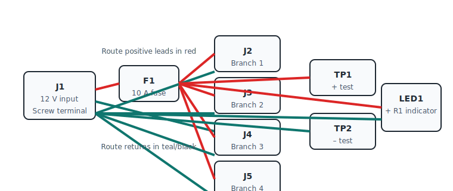

# Electronics Schematics

The `elex` folder collects KiCad and Fritzing designs used throughout the Sugarkube
project. Schematics describe the power distribution ring and related circuits.

## Power Ring KiCad Project

The **power_ring** directory contains a minimal KiCad design used as a starting point
for the Sugarkube power distribution board. The project is based on KiCad's
`custom_pads_test` demo and demonstrates basic footprint libraries and schematic
symbols. It currently exports a small two–layer board that can be iterated on for
real hardware. High‑level requirements live in
[elex/power_ring/specs.md](../elex/power_ring/specs.md).

Included files:

- `power_ring.kicad_pro` – project settings
- `power_ring.kicad_sch` – schematic
- `power_ring.kicad_pcb` – PCB layout
- `power_ring.kicad_sym` and `power_ring_schlib.kicad_sym` – symbol libraries
- `power_ring.pretty/` – footprint library

Design notes embedded in the KiCad title block highlight best practices:

- Place decoupling capacitors near power pins.
- Keep high-current traces short for better performance.
- Label polarity and voltage on connectors to avoid wiring mistakes.
- Verify KiBot exports before fabrication.
- Verify ground-pour clearance around mounting holes.
- Double-check LED orientation during assembly.

Open the project in **KiCad 9** or newer and modify the schematic to suit your power
distribution needs (for example, add screw terminals, fuses and test points). Use
[KiBot](https://github.com/INTI-CMNB/KiBot) with `.kibot/power_ring.yaml` or run the
GitHub workflow to produce Gerber files, a PDF schematic and a BOM in
`build/power_ring/`.
The `scripts/checks.sh` helper now installs KiCad 9 automatically when
you modify `.kicad_*` files (or set `SUGARKUBE_FORCE_KICAD_INSTALL=1`),
pulling the official 9.0 packages on Debian/Ubuntu or the Homebrew cask
elsewhere so exports succeed without manual setup. After installing, it
probes `python`, `python3`, and the common `python3.x` shims so it can
reuse whichever interpreter exposes KiCad's `pcbnew` module—even when
`actions/setup-python` provides a newer Pyenv build that lacks the
package. It also deepens shallow clones and fetches the base branch
during CI so electronics edits are detected even when only the newest
commit is available.

The layout now includes a "SugarKube" copper label for easy identification.

## Fritzing Sketch

Use the wiring map below to reproduce the power ring harness in
[Fritzing](https://fritzing.org/) or during bench assembly. The repository now
ships a structured connection list at
[`docs/fritzing/power_ring_wiring.csv`](./fritzing/power_ring_wiring.csv) that
records every net, suggested wire colour, and safety note. Import it into a
spreadsheet while you route traces so each jumper is accounted for.

| Connector | Function | Suggested Wire | Notes |
| --- | --- | --- | --- |
| J1 | 12&nbsp;V DC input screw terminal | 16&nbsp;AWG red (positive) / 16&nbsp;AWG black (return) | Feed from a regulated supply or charge controller and keep leads short. |
| F1 | 10&nbsp;A blade fuse | Inline with J1 positive lead | Protects the entire ring; carry spares for field swaps. |
| TP1 / TP2 | Voltage test points | 22&nbsp;AWG jumpers | Clip a multimeter here before powering downstream loads. |
| J2&nbsp;–&nbsp;J5 | 2-pin JST-VH branch outputs | 18&nbsp;AWG red/black pairs | Power Raspberry Pi nodes, fans, or lighting; label each lead to match the project. |
| LED1 + R1 | Power indicator LED and series resistor | 26&nbsp;AWG | Choose the resistor footprint that matches your LED forward voltage/current. |

### Recreate or customise the sketch

1. Launch Fritzing 1.0 or newer and create a **New Sketch**.
2. In the **Parts** bin, drag a 2-pin screw terminal, four 2-pin JST-VH
   connectors, a mini blade fuse, two test points, and an LED with a series
   resistor onto the breadboard view.
3. Use the table above together with the CSV manifest to route positive leads in
   red and returns in black. Add labels such as `OUT1`–`OUT4` so the layout
   mirrors the KiCad schematic.
4. (Optional) Set the breadboard background image to
   `docs/images/power_ring_wiring.svg` for a quick reference while wiring.
5. Export the updated design via **File → Export → Image (SVG)** to refresh the
   diagram in this repository and attach the `.fzz` sketch to build logs or
   design reviews.

Because the wiring list lives alongside the KiCad project, any connector or fuse
changes can be captured in both files during the same pull request.
