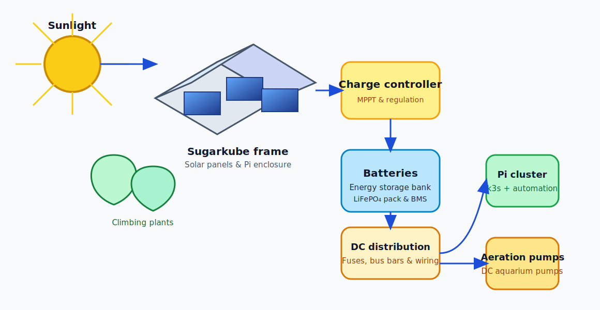

# Sugarkube

Welcome to **sugarkube**, a solar-powered off-grid platform for Raspberry Pis and aquarium aeration.
This repo tracks CAD models, electronics schematics, and documentation
so anyone can replicate the setup.
Greenery is encouraged around the cube. Vines can climb the extrusions while
herbs and shade-loving plants enjoy the cover of the solar panels.

*Figure: Power from the solar panels flows through the charge controller and batteries to the
Pi cluster and aquarium aerator while the frame supports climbing plants.*

## Getting Started
Review the safety notes before working with power components.

- [SAFETY.md](SAFETY.md) — wiring and battery safety guidelines
- [build_guide.md](build_guide.md) — step-by-step assembly instructions
- [pi_cluster_carrier.md](pi_cluster_carrier.md) — details on the Raspberry Pi mounting plate
- [lcd_mount.md](lcd_mount.md) — optional 1602 LCD placement
- [insert_basics.md](insert_basics.md) — heat-set inserts and printed threads
- [network_setup.md](network_setup.md) — connect the cluster to your network
- [mac_mini_station.md](mac_mini_station.md) — press-fit cap for the Mac mini keyboard station
- [electronics_schematics.md](electronics_schematics.md) — KiCad and Fritzing designs
- [pi_carrier_launch_playbook.md](pi_carrier_launch_playbook.md) — end-to-end guide from download to k3s
- [pi_image_quickstart.md](pi_image_quickstart.md) — build, flash and boot the preloaded Pi image
- [pi_smoke_test.md](pi_smoke_test.md) — run remote smoke tests against freshly provisioned Pis
- [pi_image_contributor_guide.md](pi_image_contributor_guide.md) — map automation helpers to the docs
  they inform
- [pi_support_bundles.md](pi_support_bundles.md) — collect diagnostics into shareable archives
- [pi_image_telemetry.md](pi_image_telemetry.md) — opt-in anonymized telemetry for fleet dashboards
- [pi_image_team_notifications.md](pi_image_team_notifications.md) — optional Slack/Matrix progress
  notifications for first boot and SSD cloning
- [pi_image_cloudflare.md](pi_image_cloudflare.md) — preconfigure Docker and Cloudflare tunnels
- [pi_image_improvement_checklist.md](pi_image_improvement_checklist.md) — backlog of DX upgrades for the Pi image
- [ssd_post_clone_validation.md](ssd_post_clone_validation.md) — validate SSD clones post-migration
- [raspi_cluster_setup.md](raspi_cluster_setup.md) — build a three-node k3s cluster and deploy apps
- [docker_repo_walkthrough.md](docker_repo_walkthrough.md) — deploy any Docker-based repo
- [projects-compose.md](projects-compose.md) — run token.place & dspace via docker compose
- [pi_token_dspace.md](pi_token_dspace.md) — build and expose token.place & dspace via Cloudflare
- [token_place_sample_datasets.md](token_place_sample_datasets.md) — replay bundled
  token.place health and chat samples
- [pi_image_builder_design.md](pi_image_builder_design.md) — design and reliability features of the image builder

## Learn the Fundamentals
- [solar_basics.md](solar_basics.md) — how photovoltaic panels work
- [electronics_basics.md](electronics_basics.md) — wiring, tools, and safety
- [power_system_design.md](power_system_design.md) — sizing batteries and choosing a
  charge controller
- [outage_catalog.md](outage_catalog.md) — structured archive of incidents

Start with the basics and progress toward a fully autonomous solar cube.

## LLM Prompts
- [prompts-codex.md](prompts-codex.md) — baseline Codex instructions for maintaining the repo
- [prompts-codex-cad.md](prompts-codex-cad.md) — keep OpenSCAD models rendering cleanly
- [prompts-codex-docs.md](prompts-codex-docs.md) — refine build guides and reference docs
- [prompts-codex-pi-image.md](prompts-codex-pi-image.md) — maintain the Pi image tooling
- [prompts-codex-pi-token-dspace.md](prompts-codex-pi-token-dspace.md) —
  bootstrap token.place & dspace on Pi
- [prompts-codex-docker-repo.md](prompts-codex-docker-repo.md) — improve Docker repo guides
- [prompts-codex-ci-fix.md](prompts-codex-ci-fix.md) — diagnose and fix failing checks
- [prompts-codex-spellcheck.md](prompts-codex-spellcheck.md) — correct spelling in docs
