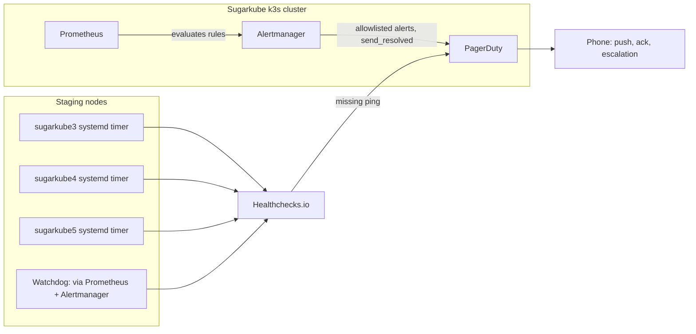

# Sugarkube observability alerting strategy

This is the canonical alerting strategy for Sugarkube. It defines the agreed target architecture,
routing policy, alert inventory, and rollout/drill plan for turning the staging observability stack
described in [`docs/observability-design.md`](./observability-design.md) and
[`docs/observability-operations.md`](./observability-operations.md) into something that actually pages
a human. **Nothing in this document is deployed yet.** Alertmanager currently ships a no-op `"null"`
receiver in staging (see [`docs/observability-operations.md`](./observability-operations.md)); this
document records the plan for closing that gap, not evidence that it is closed.

## 1. Goals and non-goals

### Goals

- Actionable alerts with low noise: every alert that pages has a runbook and a real operator action.
- Phone notifications that can be acknowledged, not just a webhook that fires into the void.
- Detection of individual staging-node failures (a single Pi going down), not just cluster-wide
  symptoms.
- Detection of failure of the monitoring stack itself — if Prometheus or Alertmanager goes down, that
  must not silently mean "no alerts, therefore everything is fine."
- Resolved notifications, so an operator who was paged also finds out when the problem clears.
- Repeatable staging failure drills that prove delivery works before anything routes to production.
- Secret-safe, repository-driven configuration: routing keys and ping URLs never enter Git.

### Non-goals (later stages)

- Production alert rollout. This document designs the staging path first; production follows only
  after staging drills succeed (see [`docs/observability-design.md`](./observability-design.md) §13).
- Advanced SLOs, burn-rate alerting, or multi-window error budgets.
- Exhaustive application-level synthetic checks. The one synthetic check currently in scope
  (`DspaceChatSyntheticFailed`) is deferred — see [§8](#8-status-and-dependencies).

## 2. Chosen target architecture

PagerDuty plus Healthchecks.io is the preferred target architecture:

- Prometheus evaluates in-cluster alerting rules.
- Alertmanager routes an explicit allowlist of tested Sugarkube alerts to PagerDuty. The default
  route stays on the existing no-op `"null"` receiver; only named, reviewed alerts move off it.
- PagerDuty provides push notifications, acknowledgement, escalation policies, and incident history.
- Healthchecks.io supplies an independent dead-man path for failures the in-cluster stack cannot
  reliably report on its own — most importantly, the monitoring stack's own host going down.
- Healthchecks.io notifications also flow to PagerDuty, so the phone workflow stays a single,
  consistent surface regardless of which path detected the problem.

The redundancy is deliberate: if the node hosting Prometheus or Alertmanager goes down, that stack may
be unable to send its own alert about itself. An external heartbeat service that expects a periodic
ping — and pages when the ping stops arriving — is the only mechanism that can catch that failure
mode, because it does not depend on anything running inside the cluster it is watching.

## 3. External heartbeats

Planned checks:

- One host-level heartbeat per staging node — `sugarkube3`, `sugarkube4`, `sugarkube5` — each a
  `systemd` timer running directly on that node, pinging its own dedicated Healthchecks.io check.
- One observability watchdog heartbeat whose successful path traverses Prometheus and Alertmanager
  before reaching Healthchecks.io (for example, a Prometheus rule that is always true, routed through
  Alertmanager to a webhook receiver that pings Healthchecks.io for each Alertmanager notification).
  Alertmanager does not notify on every Prometheus rule evaluation: its `group_wait`,
  `group_interval`, and `repeat_interval` control notification timing. A missed ping means either
  Prometheus stopped evaluating, Alertmanager stopped routing, or the path between them and the
  outside world broke — not that a specific rule fired.

The watchdog route must have an explicit timing contract rather than inheriting the general alert
route. The initial target is a 1-minute rule evaluation interval, `group_wait: 30s`, and a
watchdog-specific `repeat_interval: 5m`. Configure the Healthchecks.io check for a 5-minute expected
period plus at least 2 minutes of grace, allowing for delivery jitter without hiding a sustained
failure. Keep `group_interval` at or below 5 minutes so grouping changes cannot postpone the next
watchdog notification beyond the expected ping period. If these values change, preserve the
invariant that the maximum healthy notification gap is no longer than the Healthchecks.io period,
with grace reserved for jitter, and update both systems together.

Node heartbeats are host-level `systemd` timers rather than Kubernetes CronJobs deliberately: a
CronJob only proves the k3s control plane can still schedule pods somewhere in the cluster, not that a
particular physical node is powered on and reachable. A `systemd` timer running on the node itself is
the only check that actually proves that node is alive.

Each Healthchecks.io check gets its own unique ping URL. These URLs must be stored outside Git — in
root-readable local configuration on the node (e.g. an `EnvironmentFile` read by the timer's unit) or
in a suitable secret store, never committed to this repository.

What each check detects, and does not:

| Check | Detects | Does not detect |
| --- | --- | --- |
| Per-node `systemd` timer (`sugarkube3`/`4`/`5`) | That specific node is powered on, booted, and can reach the internet | Whether k3s, workloads, or Prometheus on that node are healthy |
| Observability watchdog | Prometheus is evaluating rules and Alertmanager is routing them successfully out of the cluster | Which specific in-cluster alert, if any, is currently firing |
| PagerDuty (in-cluster alerts) | Anything an allowlisted Prometheus rule can observe | Total loss of the node hosting Prometheus/Alertmanager itself (that's what the watchdog + node heartbeats are for) |

## 4. PagerDuty routing policy

- Preserve the root/default null receiver at first. Nothing routes to PagerDuty by default.
- Route only explicitly named, reviewed, and tested Sugarkube alerts to PagerDuty — an allowlist, not
  the chart's entire default rule set. Do not forward `kube-prometheus-stack`'s bundled rules
  wholesale before auditing each one individually.
- Use Alertmanager's PagerDuty integration with a secret file reference, for example
  `routing_key_file: /etc/alertmanager/secrets/pagerduty-routing-key`, never an inline key committed to
  Git.
- Set `send_resolved: true` on the PagerDuty receiver so incidents auto-resolve when the underlying
  alert clears.
- Define sensible `group_by`, `group_wait`, `group_interval`, and `repeat_interval` values so a single
  incident (e.g. one node flapping) doesn't generate a storm of separate pages.
- Require labels on every routed alert: `severity`, `cluster`, `environment`, and a relevant resource
  identity label (node name, app, namespace, or route as applicable).
- Require a useful `summary`, `description`, and a `runbook_url` annotation on every routed alert —
  no alert reaches PagerDuty without a documented next step.
- Distinguish urgent, paging `severity: critical` alerts from `severity: warning`/informational
  signals; only `critical` alerts should page a phone by default.

## 5. Planned alert inventory

These are the current alert-design candidates, not proof the rules already exist in this repository.

| Alert | Intent | Notes |
| --- | --- | --- |
| Node not ready/down | Detect a staging node going offline | First audit `kube-prometheus-stack`'s bundled `KubeNodeNotReady` rule; reuse it if its semantics/labels fit. Add a narrowly scoped custom rule only if the bundled rule doesn't. Target roughly a 5-minute threshold before paging. |
| `DspaceMetricsTargetDown` | DSPACE's authenticated `ServiceMonitor` target(s) stop being scraped | Complements the node/API-level `PrometheusScrapeDown` signal in [`docs/observability-design.md`](./observability-design.md) §6 with a DSPACE-specific name for routing. |
| `DspaceInstrumentationDown` | DSPACE's own `dspace_instrumentation_up` gauge reports unhealthy | App-reported health, distinct from scrape-target health. |
| `DspaceMixedBuildRevisions` | DSPACE pods in a release are running more than one build revision at once | Signals a stuck or partial rollout. |
| `PublicEndpointDown` | A blackbox probe's `probe_success` is 0 | Reuses the signal already defined in [`docs/observability-design.md`](./observability-design.md) §6/§11. |
| `PublicProbeMissing` | An expected blackbox probe target has no recent data at all (distinct from a probe that ran and failed) | Matches the "missing probe data" state already surfaced in the staging dashboard's availability summary panel. |
| `TLSExpiringSoon` | `probe_ssl_earliest_cert_expiry` crosses a warning/critical threshold | Reuses the signal already defined in [`docs/observability-design.md`](./observability-design.md) §6. |
| `DspaceChatSyntheticFailed` | A deeper synthetic check exercises DSPACE's dChat path end-to-end | **Explicitly deferred** — see [§8](#8-status-and-dependencies). Not part of the initial rollout. |

## 6. Rollout and drill plan

A safe, phased sequence — each step depends on the previous one succeeding:

1. Establish PagerDuty and Healthchecks.io accounts and integrations manually (outside this repo).
2. Add secret-safe Alertmanager receiver configuration (`routing_key_file`, no inline secrets),
   still routed to nothing by default.
3. Send and resolve a synthetic PagerDuty test alert to prove the receiver config and phone delivery
   work end-to-end, independent of any real Sugarkube rule.
4. Add and verify the external node heartbeats and the observability watchdog against Healthchecks.io.
   Confirm the watchdog's dedicated Alertmanager timing and the Healthchecks.io period/grace match
   the contract in §3; observe multiple repeat notifications before declaring the path healthy.
5. Audit the existing `kube-prometheus-stack` bundled node rules (starting with `KubeNodeNotReady`).
6. Enable the node-down route in Alertmanager's allowlist.
7. Identify which staging nodes currently host Prometheus and Alertmanager.
8. Power down a *different* staging node first — never the one hosting Prometheus/Alertmanager for
   the first drill.
9. Confirm the full path: the alert fires, the phone receives it, it can be acknowledged, the node
   recovers, and a resolved notification arrives.
10. Only after that external-redundancy path is proven, intentionally power down the node hosting
    Prometheus/Alertmanager and confirm Healthchecks.io — not PagerDuty via Alertmanager — detects the
    missing heartbeat and still reaches a phone.
11. Drill the watchdog timing separately: stop its Alertmanager receiver immediately after a
    successful ping and confirm Healthchecks.io declares it late after the 5-minute period plus grace,
    then restore it and confirm the next notification recovers the check. Record observed notification
    gaps and detection latency; fail the drill if a healthy gap exceeds the configured period.
12. Add custom application and blackbox alerts one at a time, each with its own drill before the next
    is added.
13. Return to `DspaceChatSyntheticFailed` once token.place staging inference is operational again
    (see [§8](#8-status-and-dependencies)).

Rollback and noise control:

- Any alert that pages without a clear operator action gets removed from the PagerDuty allowlist
  immediately, not silenced indefinitely — a silenced-but-still-allowlisted alert is easy to forget.
- Prefer narrowing a noisy rule's threshold or window over routing it to a lower urgency; if neither
  fixes it within a reasonable time, pull it from the allowlist and revisit later.
- Each drill step should be individually reversible: routing changes are additive to the allowlist, so
  removing one alert's route never affects the others.

## 7. Alternatives considered

- **PagerDuty alone** — lacks an independent dead-man path. If the node running Prometheus/
  Alertmanager goes down, PagerDuty never hears about it, because nothing is left to tell it.
- **Better Stack** — could provide a more consolidated hosted alternative (uptime monitoring plus
  incident management in one product), but wasn't chosen as the initial direction; worth revisiting if
  PagerDuty + Healthchecks.io proves awkward to operate.
- **Pushover** — lighter-weight and cheaper than PagerDuty, but has no acknowledgement/escalation/
  incident-history workflow, which is a stated goal.
- **Self-hosted Healthchecks** — would reduce the external dependency, but if hosted on the same
  cluster it's meant to watch, it loses the independence that makes an external dead-man switch
  useful in the first place.

PagerDuty plus an externally hosted Healthchecks.io is the preferred initial direction because it is
the only combination here that gives both an acknowledgeable phone workflow *and* a dead-man path that
survives the monitoring stack's own node going down. Nothing about this preference implies any part of
it is deployed yet — see the rollout plan above for the actual sequencing.

## 8. Status and dependencies

- The deeper DSPACE dChat synthetic check (`DspaceChatSyntheticFailed`) is deferred while token.place
  staging inference depends on work tracked in `futuroptimist/token.place#1549`. This blocks only that
  one synthetic check, not the rest of the alerting foundation.
- Shallow public-endpoint blackbox monitoring (`PublicEndpointDown`, `PublicProbeMissing`,
  `TLSExpiringSoon`) is already live in staging today, independently of that dependency — see
  [`docs/observability-blackbox.md`](./observability-blackbox.md).
- Alert delivery to a phone and node-power-off drills have not yet been performed. Everything in
  [§6](#6-rollout-and-drill-plan) above is planned, not completed.
