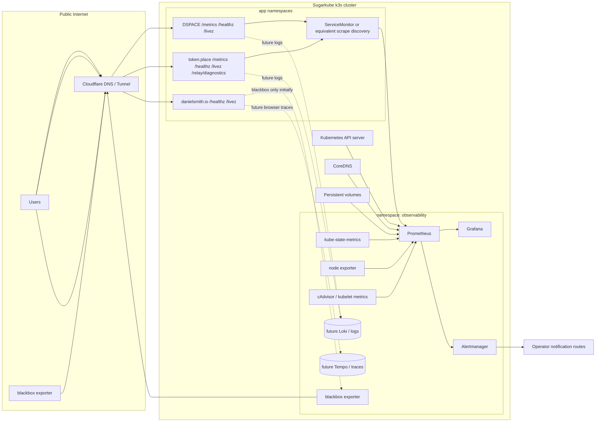

# Sugarkube observability design

This is the canonical, implementation-ready observability design for Sugarkube and the flagship applications it hosts: DSPACE, token.place, and danielsmith.io. It is a design contract only: this document does not install Prometheus, Grafana, Loki, exporters, dashboards, Helm values, manifests, or runtime dependencies.

The older [Codex observability bootstrap prompt](prompts/codex/observability.md) remains useful as a future implementation prompt, but this design supersedes it as the source of truth for scope, ownership, privacy, and release gates. In particular, Loki, public Grafana exposure, a GitHub exporter, and kiosk work from that prompt are later phases here unless a future implementation PR explicitly accepts those dependencies.

## Audit basis

Local Sugarkube files audited before writing this design:

- [README.md](../README.md), especially the GHCR-first app runbook list and Pi-image observability notes.
- [docs/index.md](index.md), [docs/app_deployment_contract.md](app_deployment_contract.md), [docs/pi_image_telemetry.md](pi_image_telemetry.md), and [docs/prompts/codex/observability.md](prompts/codex/observability.md).
- [platform/](../platform/), including the existing kube-prometheus-stack, Loki, Promtail, Cloudflare, external-dns, and Longhorn Flux resources.
- [scripts/cloud-init/](../scripts/cloud-init/), including Docker Compose node exporter, cAdvisor, Grafana Agent, Netdata, Cloudflare, and Helm-bundle health hooks.
- Existing app runbooks: [DSPACE](apps/dspace.md), [token.place](apps/tokenplace.md), [danielsmith.io](apps/danielsmith.md), [token.place onboarding](tokenplace_sugarkube_onboarding.md), and the staging/production environment runbooks.

External public `main` branches audited on 2026-06-19:

| Repository | Audited commit | Current findings used here |
| --- | --- | --- |
| `democratizedspace/dspace` | `005dbc8e5dcc74372381b1acd938de0373c81e77` | Implements `/healthz`, `/livez`, `/metrics` via `prom-client`, a Helm chart with optional `ServiceMonitor`, release workflows, and documented JSON logging. The audit does not prove those metrics are already scraped in Sugarkube production. |
| `futuroptimist/token.place` | public `main` at audit time | Documents and implements relay/API health endpoints, optional Prometheus metrics, structured logging, Helm chart and release workflows. The audit treats relay-compute promotion evidence as required because Sugarkube runbooks warn that generic health checks do not prove the real E2EE relay path. |
| `futuroptimist/danielsmith.io` | public `main` at audit time | Implements a static nginx image with `/livez` and `/healthz`, a Helm chart, CI image/chart workflows, and an optional sidecar-generated `/runtime/github-metrics.json` cache. It does not expose Prometheus app metrics today. |

## Goals

- Provide a practical learning path from Raspberry Pi host metrics to production-grade Prometheus, Grafana, Alertmanager, and blackbox monitoring.
- Cover cluster, application, dependency, GitHub release-artifact, Cloudflare ingress/tunnel, and public availability signals.
- Optimize for a small k3s cluster on Raspberry Pis and similar SBCs: bounded scrape volume, modest retention, explicit storage budgets, and dashboards that answer operator questions quickly.
- Preserve Sugarkube's existing GHCR-first application deployment contract instead of introducing a parallel app deployment model.
- Separate operational metrics from product/content signals such as GitHub stars or portfolio project metadata.
- Define release gates that DSPACE v3.1.0, token.place v0.1.2, and danielsmith.io v0.1.0 can implement without leaking private data.
- Be explicit that this document is a design plan and does **not** claim Daniel has production Prometheus or Grafana operating experience yet. Resume claims require the evidence listed in [Release evidence](#release-evidence).

## Non-goals

- Installing or changing Prometheus, Grafana, Loki, Tempo, exporters, dashboards, Helm values, or runtime components in this PR.
- Treating Loki, Tempo, long-term object storage, multi-cluster federation, public Grafana access, a GitHub Prometheus exporter, or a kiosk as phase-one requirements.
- Publishing Grafana or Prometheus directly to the public internet.
- Using GitHub repository statistics as substitutes for service health, latency, errors, or dependency observability.
- Inventing SLOs before staging and production have produced measured baselines.

## Current-state inventory

| Platform/application area | Implemented and tested | Documented but not verified in this audit | Planned | Explicitly out of scope for this design PR |
| --- | --- | --- | --- | --- |
| Sugarkube cluster and Pi image | Pi image docs state node exporter, cAdvisor, Grafana Agent, and Netdata containers ship with the image and list scrape URLs; cloud-init compose files configure those containers. `platform/observability/` already contains Flux resources for kube-prometheus-stack, Loki, and Promtail. | The audit did not access a live cluster, so it did not verify Prometheus, Grafana, Alertmanager, Loki, or Promtail are healthy in staging or production. Existing platform manifests are scaffolding until live deployment evidence exists. | Standardize an `observability` namespace, retention/storage budgets, ServiceMonitor selectors, blackbox targets, dashboards, and runbooks. | Runtime installation or chart/value changes. |
| DSPACE | Public `main` implements `/healthz`, `/livez`, `/metrics`, chart probes, optional `ServiceMonitor`, and CI health checks. Sugarkube runbooks verify `/config.json`, `/healthz`, and `/livez`. | DSPACE docs describe protected metrics and structured JSON logs, but this audit did not verify Sugarkube currently scrapes DSPACE metrics in staging or production. | DSPACE v3.1.0 release gate should add bounded dChat and dependency metrics, dashboard panels, alerts, and privacy review. | Persisting chat content, player save data, inventory, user identity, prompts, or responses in metrics/logs. |
| token.place | Sugarkube runbooks and onboarding require `/`, `/livez`, `/healthz`, `/relay/diagnostics`, `/api/v1/meta`, and real relay-compute evidence. Public `main` documents/implements health, optional metrics, structured logging, Helm support, and image/chart workflows. | The audit did not prove production scraping, queue metrics, or alerting are deployed. Health/diagnostics alone are explicitly insufficient for promotion in Sugarkube runbooks. | token.place v0.1.2 release gate should expose relay/API v1 metrics, compute-node health, queue depth, lease age, upstream inference, in-flight/timeout/rate-limit metrics, and E2EE-safe dashboards. | Reviving legacy relay APIs, API v1 streaming, or logging plaintext/ciphertext payloads beyond relay-blind routing metadata. |
| danielsmith.io | Public `main` implements static nginx `/livez` and `/healthz`, CI checks those endpoints, Helm chart support, and a sidecar cache for `/runtime/github-metrics.json`. Sugarkube runbooks verify `/`, `/livez`, `/healthz`, and manually verify the runtime GitHub metrics cache in staging/prod. | No app `/metrics` endpoint is implemented today. Browser performance telemetry hooks exist in the app code, but this audit does not treat them as production observability. | danielsmith.io v0.1.0 release gate should rely on blackbox probes, Kubernetes deployment metrics, image/release identity, TLS expiry, and an optional future privacy-reviewed browser telemetry phase. | Treating GitHub stars/open issues as operational service health. |
| Cloudflare ingress/tunnels | Sugarkube platform contains Cloudflare tunnel and external-dns resources with metrics settings; DSPACE docs mention Cloudflare health checks against `/healthz`. | The audit did not verify active Cloudflare tunnel metrics, DNS records, Access policy, or public probe success. | Add blackbox probes for public routes and TLS expiry; monitor cloudflared pod readiness and tunnel metrics when exposed internally. | Managing DNS/Cloudflare as part of Helm app deployment. |
| GitHub Actions and release artifacts | App runbooks link image and chart workflows/packages; CI workflows in external repos build images/charts and run endpoint smoke tests. Sugarkube release docs use immutable tags and chart pins. | The audit did not verify the latest workflow run status for every repo or package digest. | Dashboards may show release identity and latest approved artifact metadata, but operational alerts must come from runtime signals. | Paging on GitHub stars, forks, open issues, or content metrics. |

## Ownership boundaries

Application repositories own:

- Application metrics and the `/metrics` handler when the app exposes Prometheus metrics.
- Bounded label vocabularies, metric naming, histograms, health endpoints, release/build identity, container images, Helm chart scrape hooks, NetworkPolicy openings for scraping, and app-specific runbooks.
- Privacy review for every app metric, log field, dashboard, and alert annotation.

Sugarkube owns:

- Prometheus, Grafana, Alertmanager, blackbox exporter, shared dashboard provisioning, alert routing, retention, persistent storage budgets, and cluster runbooks.
- Environment configuration, namespace and ServiceMonitor discovery conventions, public endpoint probe target lists, staging/prod separation, and shared alert labels.
- Cluster, node, pod, PV, DNS, API server, Cloudflare/tunnel, scrape-health, and Alertmanager delivery observability.

Separations:

- Cloudflare and DNS are platform/network concerns and remain separate from Helm application deployment.
- GitHub repository statistics are product/content or release-evidence signals, not substitutes for uptime, latency, error rate, scrape health, or dependency metrics.
- App runbooks continue to use the generic `just app-*` deployment contract; observability integrations attach to that contract rather than replacing it.

## Proposed architecture

### Namespaces

- `observability`: Prometheus, Grafana, Alertmanager, blackbox exporter, kube-state-metrics, and observability-only Secrets/ConfigMaps.
- `kube-system`: API server, kubelet, CoreDNS, and k3s system metrics surfaced via standard Kubernetes scraping.
- App namespaces remain per app as defined by the deployment contract: `dspace`, `tokenplace`, and `danielsmith` unless the app config explicitly changes.

### Service discovery

- Application charts should create `ServiceMonitor` resources only when enabled by environment values.
- Sugarkube Prometheus selects ServiceMonitors by an agreed label such as `sugarkube.dev/scrape: "true"` plus environment labels. Existing app chart labels may stay as-is if Prometheus is configured to select them deliberately.
- Blackbox probes are owned by Sugarkube and target public URLs and selected in-cluster Services where direct scraping is not available.

### Retention, resources, and storage

- Start with 7-15 days of local Prometheus retention, then tune after real cardinality and storage samples. Do not promise long-term retention until object storage or remote write is designed.
- Use persistent storage for Prometheus and Grafana. Size the initial Prometheus PV from measured scrape volume; provisional planning should assume single-digit GiB, then revise after staging.
- Keep scrape intervals conservative on Raspberry Pis: default 30-60 seconds for platform and app metrics, 60-300 seconds for blackbox/TLS checks unless a runbook needs faster detection.
- Cap dashboard queries to short windows by default and avoid high-cardinality ad hoc variables.

### Staging and production separation

- Staging and production must use distinct `environment` labels and distinct Grafana variables.
- Production alerts should not page until staging dashboards, scrape health, and at least one alert drill have passed.
- Staging may use shorter retention and warning-only notifications while thresholds are calibrated.

### Failure behavior

- If the observability stack is unavailable, application serving must continue.
- Operators fall back to `kubectl`, app runbook curl checks, Cloudflare dashboard checks, and release evidence until Prometheus/Grafana recover.
- Observability stack failures should raise warnings through any surviving route, but avoid recursive pages when Alertmanager itself cannot deliver.

## Metrics and labeling contract

### Naming

- Use Prometheus conventions: `snake_case`, base units in metric names, and suffixes such as `_total`, `_seconds`, `_bytes`, `_info`, and `_timestamp_seconds`.
- Application metric prefixes should be stable and app-specific: `dspace_`, `tokenplace_`, and `danielsmith_` if danielsmith.io later adds app metrics.
- Shared HTTP metrics should use names such as `<app>_http_requests_total` and `<app>_http_request_duration_seconds`.

### Required common labels

Every app metric should include only bounded values for:

- `app`: `dspace`, `tokenplace`, `danielsmith`.
- `environment`: `dev`, `staging`, `prod`, or an explicitly documented lab name.
- `cluster`: stable Sugarkube cluster slug, not a hostname or IP.
- `namespace`: Kubernetes namespace.
- `release`: immutable image tag, chart app version, or build SHA. Keep it low churn by using the deployed release identity, not per-request values.

HTTP metrics may add:

- `route`: templated route such as `/api/v1/chat/completions`, `/healthz`, or `static_asset`, never raw URLs.
- `method`: bounded HTTP method.
- `status_class`: `2xx`, `3xx`, `4xx`, `5xx`.
- `outcome`: bounded app vocabulary such as `success`, `client_error`, `server_error`, `timeout`, `rate_limited`, `dependency_failure`, `cancelled`.

### Histograms

- Use histograms for HTTP request duration, dChat latency, upstream inference latency, blackbox probe latency, and queue wait time.
- Start with coarse buckets appropriate for SBCs and human-facing web apps, then tune from staging. Avoid per-route custom bucket churn unless a measured path needs it.

### Cardinality limits

- Any single metric family should target fewer than 100 active series in the initial rollout unless explicitly reviewed.
- Any new label requires an owner, allowed-value list, and sample query before production.
- Prefer counters plus bounded labels over logs-to-metrics transforms with arbitrary text.

### Prohibited labels and payloads

Never place these in metric labels, metric values, logs intended for dashboards, alert labels, or alert annotations:

- User identifiers, account identifiers, wallet identifiers, IP addresses, request IDs, session IDs, or browser fingerprints.
- Prompts, model responses, chat content, DSPACE player save data, player inventory, custom quest content, or token.place encrypted payload bodies.
- API keys, cryptographic keys, ciphertext, bearer tokens, cookies, authentication headers, or authorization decisions that reveal user identity.
- Unbounded URLs, raw query strings, exception text, stack traces, model names, arbitrary error strings, filesystem paths containing usernames, or upstream hostnames not on an approved allowlist.

## Platform SLIs and candidate alerts

Thresholds below are provisional. Staging data must establish final thresholds before any production SLO or paging policy is claimed.

| SLI / alert candidate | Signal | Provisional threshold | Window | Notes |
| --- | --- | --- | --- | --- |
| Node readiness | Ready nodes / expected nodes | Any production node NotReady | 5m | Page only if redundancy or serving is at risk; otherwise ticket. |
| Disk pressure | Kubernetes node disk pressure or filesystem free bytes | DiskPressure true or root/PV free below 15% | 10m | Raspberry Pi storage can fail abruptly; include SSD runbook links. |
| Memory pressure | Node MemoryPressure or allocatable memory saturation | MemoryPressure true or sustained >90% | 10m | Warning first while baselines mature. |
| API server health | Prometheus scrape/up and Kubernetes API probes | API unavailable or scrape down | 5m | If Prometheus cannot reach API, validate with `kubectl` from an operator host. |
| DNS health | CoreDNS up, DNS request errors, blackbox DNS module | CoreDNS unavailable or error spike | 5m | Keep separate from upstream internet failure. |
| Pod restarts/crash loops | Restart increase and waiting reason | >3 restarts in 10m or CrashLoopBackOff | 10m | Route to app runbook by namespace/app labels. |
| Deployment readiness | Available replicas / desired replicas | Available < desired | 10m | Page only for prod user-facing apps. |
| Persistent volume health | PVC bound status, capacity, Longhorn health | PVC unbound or volume degraded | 10m | Longhorn-specific details stay in storage runbooks. |
| Public endpoint success | `probe_success` | 0 for prod endpoint | 5m | Confirm Cloudflare and in-cluster service before rollback. |
| Public latency | blackbox p95 or histogram quantile | >2s for `/` or >1s for `/healthz` | 15m | Tune after staging; avoid paging during known ISP issues unless users are affected. |
| TLS expiry | blackbox certificate expiry | <14d warning, <7d critical | 1h | Actionable if cert-manager/Cloudflare renewal is under Sugarkube control. |
| Prometheus scrape health | `up` and scrape sample errors | Critical target down or scrape errors >10% | 10m | Do not page on intentionally disabled dev scrapes. |
| Alertmanager delivery | Alertmanager config/reload and notification failures | Delivery failures sustained | 10m | Warn if no alternate route exists. |

## DSPACE-specific story

Verified current behavior:

- DSPACE exposes `/healthz` and `/livez`; CI image workflow curls `/healthz`; Sugarkube runbooks verify `/config.json`, `/healthz`, and `/livez`.
- Public `main` documents `/metrics` via `prom-client`, optional bearer protection, chart probes, and optional `ServiceMonitor`.
- Public `main` documents structured JSON logs, but this audit did not verify production log aggregation in Sugarkube.

DSPACE v3.1.0 minimum release gate:

- Public availability: blackbox probes for `https://staging.democratized.space/`, `https://staging.democratized.space/healthz`, `https://democratized.space/`, and `https://democratized.space/healthz`.
- HTTP metrics: request count and latency with `route`, `method`, `status_class`, `outcome`, and common labels.
- Process/runtime health: Node.js process uptime, memory, event-loop delay if safely available, and build/release identity via an `_info` metric or `/healthz` field.
- dChat metrics: request count, latency histogram, timeout count, rate-limit rejections, bounded outcome, and dependency-failure count. Labels must not include prompt text, response text, user identity, save data, inventory, or exception text.
- token.place dependency health: bounded counters/histograms for DSPACE-to-token.place calls and a dependency availability gauge derived from safe status classes/timeouts.
- SSR/hydration failures: only measure if the client can report bounded failure categories without URLs, user identifiers, saved game state, inventory, prompts, or responses.
- Dashboard: public availability, request rate/errors/latency, dChat outcomes, token.place dependency status, pod restarts, deployment readiness, and release identity.
- Alerts: public down, sustained 5xx, dChat timeout/rate-limit spike, token.place dependency failure, crash loop, and scrape failure. Each alert must link to the DSPACE runbook.

## token.place-specific story

Verified current behavior:

- Sugarkube runbooks require `/`, `/livez`, `/healthz`, `/relay/diagnostics`, and `/api/v1/meta` checks.
- Sugarkube onboarding states `/livez`, `/healthz`, `/`, `/metrics`, and synthetic register/poll checks do not replace a real desktop or compute-node relay path.
- Public `main` documents/implements health endpoints, optional Prometheus metrics, structured JSON logs, Helm support, and image/chart release workflows. The audit did not verify production scrape deployment.

Relay-blind E2EE invariants:

- Metrics, logs, dashboards, alerts, and runbooks must remain ciphertext-blind and content-blind.
- Allowed labels are bounded routing and state categories. Disallowed data includes plaintext prompts/responses, ciphertext bodies, cryptographic keys, API keys, authentication headers, user identity, IPs, request IDs, arbitrary model names, and raw upstream errors.

Token.place v0.1.2 minimum release gate:

- Relay and API v1 availability: blackbox probes and app metrics for `/livez`, `/healthz`, `/api/v1/meta`, and the documented relay diagnostics path.
- Request rate and latency: HTTP/API v1 counters and histograms with `route`, `method`, `status_class`, `outcome`, and common labels.
- Queue depth: gauges for queued work by bounded queue class, plus queue wait histograms if available.
- Compute nodes: registered count, healthy count, stale count, and lease age histogram/gauge with no node identity labels.
- Lease eviction: stale-node eviction counters and max lease age.
- In-flight lifecycle: gauges/counters for in-flight requests, cancellations, timeouts, and rate-limit rejections.
- Upstream inference: dependency availability and latency by bounded provider class or deployment class only if the values are approved and finite. Do not label by arbitrary model name.
- Pod restarts and in-memory state loss: dashboard row and alert note that restarts can drop accepted in-memory relay state; mitigation is drain/rollback per runbook.
- Release identity: image tag/chart version/build SHA surfaced in health or `_info` metrics.
- Dashboard: relay health, API v1 traffic, compute-node fleet, queue/in-flight state, upstream dependency, E2EE-safe error outcomes, pod restarts, and release identity.
- Alerts: public down, relay diagnostics unhealthy, zero healthy compute nodes in prod, stale lease accumulation, queue depth high, timeout/rate-limit spike, upstream dependency failure, crash loop, and scrape failure.

## danielsmith.io-specific story

Verified current behavior:

- Public `main` is a static nginx application with `/livez` and `/healthz` health endpoints; CI checks both endpoints.
- The Helm chart configures probes and the optional GitHub metrics cache sidecar.
- Sugarkube runbooks verify `/`, `/livez`, `/healthz`, and manually verify `/runtime/github-metrics.json` for staging/prod.
- Client-side performance/failover telemetry hooks exist, but no production Prometheus `/metrics` endpoint is implemented today.

Danielsmith.io v0.1.0 minimum release gate:

- Blackbox monitoring for `https://danielsmith.io/`, `/livez`, `/healthz`, and `/resume.pdf`, plus staging equivalents.
- TLS expiry, public latency, and HTTP status monitoring via blackbox exporter.
- Kubernetes deployment readiness, pod restarts, nginx resource saturation, and image/release identity from Kubernetes labels/annotations or health metadata.
- Runtime GitHub metrics cache freshness and schema checks may be dashboard context, but GitHub project metadata is not operational health.
- Browser performance and failover telemetry remain a later privacy-reviewed phase. Any future browser telemetry must avoid user identity, IPs, raw URLs, browser fingerprints, and free-form errors.
- Dashboard: public availability/TLS, static asset checks, pod readiness/restarts/resources, GitHub cache freshness, and release identity.
- Alerts: public down, `/resume.pdf` unavailable, TLS expiry, deployment unavailable, crash loop, and GitHub cache stale as warning only.

## Dashboards

| Dashboard | Audience | Primary questions | Rows | Source metrics |
| --- | --- | --- | --- | --- |
| Sugarkube cluster overview | Platform operator | Is the k3s cluster healthy enough to serve apps? | Nodes; API server; CoreDNS; pods/restarts; PV/storage; resource saturation; scrape health | kube-state-metrics, kubelet/cAdvisor, node exporter, API server, CoreDNS, Prometheus `up` |
| Application fleet overview | Platform + app owners | Which apps are healthy, what release is running, and where is user impact likely? | Availability by app/env; deployment readiness; HTTP rate/errors/latency; pod restarts; release identity; dependency summary | App metrics, kube-state-metrics, blackbox, release labels |
| DSPACE | DSPACE owner | Is the learning/game app available and is dChat healthy without leaking user data? | Public probes; HTTP RED; dChat outcomes; token.place dependency; SSR/hydration safe categories; pods; release | DSPACE metrics, blackbox, Kubernetes metrics |
| token.place | token.place owner | Is the relay/API path available and are compute nodes processing requests safely? | Public probes; API v1 traffic; relay diagnostics; queue/in-flight; compute nodes; upstream inference; E2EE-safe outcomes; pods; release | token.place metrics, blackbox, Kubernetes metrics |
| danielsmith.io | Site owner | Is the static portfolio and resume reachable, and is the deployment healthy? | Public probes; TLS; `/resume.pdf`; deployment/pod resources; GitHub cache freshness; release | blackbox, Kubernetes metrics, optional cache freshness check |
| External availability and TLS | Platform operator | Are public routes and certificates healthy through Cloudflare? | Endpoint success; latency; TLS expiry; DNS/probe failures; Cloudflare tunnel pod health | blackbox, cloudflared metrics if exposed, Kubernetes metrics |

## Alerts and runbooks

| Alert | Severity | Signal | Provisional threshold | Window | Likely causes | Runbook | Rollback/mitigation |
| --- | --- | --- | --- | --- | --- | --- | --- |
| `SugarkubeNodeNotReady` | critical in prod | Node Ready false | Any prod node NotReady | 5m | Power, SD/SSD failure, network, k3s failure | [Pi boot troubleshooting](pi_boot_troubleshooting.md), [cluster troubleshooting](raspi_cluster_troubleshooting.md) | Move workloads, reboot node, restore from SSD/image runbook. |
| `SugarkubeDiskPressure` | warning/critical | Disk pressure or low free bytes | <15% warning, <10% critical | 10m | Logs, image cache, PV growth, SSD issue | [SSD health monitor](ssd_health_monitor.md), [storage recovery](ssd_recovery.md) | Clean safe caches, expand/migrate PV, replace SSD. |
| `CoreDNSUnavailable` | critical | CoreDNS pods unavailable or DNS probes fail | Any prod DNS outage | 5m | CoreDNS crash, network policy, API issue | [cluster troubleshooting](raspi_cluster_troubleshooting.md) | Roll back recent platform changes, restart CoreDNS if safe. |
| `AppDeploymentUnavailable` | critical for prod apps | Available replicas < desired | Sustained shortage | 10m | Bad image, pull failure, probe failure, resource pressure | App runbook under `docs/apps/` | Roll back with app promotion/rollback command. |
| `AppCrashLooping` | warning/critical | Restart burst or CrashLoopBackOff | >3 restarts | 10m | Bad config, dependency outage, OOM | App runbook under `docs/apps/` | Inspect logs/events, roll back image/chart, scale down if harmful. |
| `PublicEndpointDown` | critical for prod | `probe_success == 0` | Public endpoint down | 5m | Cloudflare, ingress, app, DNS, cert | App runbook plus [Cloudflare guide](pi_image_cloudflare.md) | Compare in-cluster curl vs public; roll back app or tunnel config. |
| `TLSCertificateExpiringSoon` | warning/critical | Cert expiry | <14d warning, <7d critical | 1h | cert-manager/Cloudflare renewal issue | [cluster operations](raspi_cluster_operations.md) | Renew cert, inspect issuer, validate DNS. |
| `PrometheusScrapeFailing` | warning | `up == 0` or scrape errors | Critical target down | 10m | ServiceMonitor mismatch, NetworkPolicy, app metrics down | This design doc and app runbook | Fix discovery/NetworkPolicy; do not roll back app unless health is affected. |
| `AlertmanagerDeliveryFailing` | warning | Notification failures | Sustained failures | 10m | Bad webhook, expired token, network | Future `docs/runbooks/alertmanager.md` | Fix route/Secret; use manual checks until delivery recovers. |
| `DspaceDchatDependencyFailing` | warning/critical | token.place dependency failures/timeouts | >5% failures provisional | 15m | token.place outage, network, rate limit | [DSPACE runbook](apps/dspace.md), [token.place runbook](apps/tokenplace.md) | Disable feature flag or roll back DSPACE/token.place per evidence. |
| `TokenplaceNoHealthyComputeNodes` | critical | Healthy compute nodes | 0 in prod | 5m | Compute node offline, lease expiry, relay issue | [token.place runbook](apps/tokenplace.md) | Restore compute node, roll back relay, or pause traffic. |
| `DanielsmithResumeUnavailable` | warning/critical | blackbox `/resume.pdf` | Probe failure | 10m | Static asset missing, ingress/nginx issue | [danielsmith.io runbook](apps/danielsmith.md) | Roll back image/chart or restore asset. |

Avoid paging on symptoms with no immediate operator response, such as GitHub stars changing, dev-environment scrapes down, cache refresh warnings during a known GitHub API outage, or staging-only threshold experiments.

## Phased deployment

1. **Inventory and naming contract**: finalize labels, metric names, allowed outcome values, and app chart conventions. Can proceed in parallel across app repos.
2. **Cluster monitoring foundation**: verify or deploy Prometheus, Grafana, Alertmanager, kube-state-metrics, node/kubelet metrics, retention, PVs, and namespace policies in staging.
3. **Blackbox monitoring**: add staging/prod public endpoint and TLS probes for DSPACE, token.place, danielsmith.io, Cloudflare routes, and selected health endpoints.
4. **Application scrape integration**: enable DSPACE and token.place `ServiceMonitor` integration in staging after app release gates provide safe metrics. danielsmith.io remains blackbox/Kubernetes-only unless it adds app metrics later.
5. **Dashboards**: build the six initial dashboards with staging data first; review query cost and cardinality on Raspberry Pis.
6. **Alerts**: enable warning-only alerts in staging, then production notifications for actionable cases after runbooks exist.
7. **Staging failure drills**: test at least one app rollback, one public endpoint failure, one scrape failure, and one Alertmanager delivery path.
8. **Production rollout**: promote only after staging dashboards, alerts, and runbooks have evidence.
9. **Post-release baseline review**: after 1-2 weeks, replace provisional thresholds with measured baselines and document any SLOs separately.

Parallel work:

- App repos can implement metrics contracts while Sugarkube validates Prometheus/Grafana storage and blackbox monitoring.
- Dashboard drafts can start after naming contracts, but production alerts should wait for staging scrape data.
- Runbook updates should land with each app release gate, not after production incidents.

## Release evidence

Prometheus or Grafana may not be listed as resume skills on the basis of this design alone. Minimum evidence before making that claim:

- Successful staging and production deployments of Prometheus/Grafana or the selected observability stack.
- Dashboards backed by real staging and production metrics, not mocks or static screenshots.
- At least one tested alert delivered through Alertmanager or the selected notification path.
- At least one documented failure drill or real incident with timeline, diagnosis, and resolution.
- Operator runbooks for cluster observability, app metrics scraping, blackbox probes, Alertmanager delivery, and rollback/mitigation.
- Release notes or QA evidence from DSPACE v3.1.0, token.place v0.1.2, and danielsmith.io v0.1.0 showing that their metrics/privacy/release-gate requirements were met.

## Open questions

- Which exact Prometheus Operator `ServiceMonitor` selector labels should Sugarkube standardize on without breaking existing chart defaults?
- Should metrics endpoints require bearer tokens in-cluster, mTLS, NetworkPolicy-only isolation, or a combination?
- What initial Prometheus PV size is appropriate after measuring staging cardinality on the target Raspberry Pi hardware?
- Which notification route is acceptable for production alerts: email, Slack, Matrix, ntfy, or another self-hosted channel?
- Should future Loki adoption use single-binary local retention only, or wait until object storage is available?
- What is the approved bounded vocabulary for token.place upstream provider/deployment classes without revealing private model or routing details?
