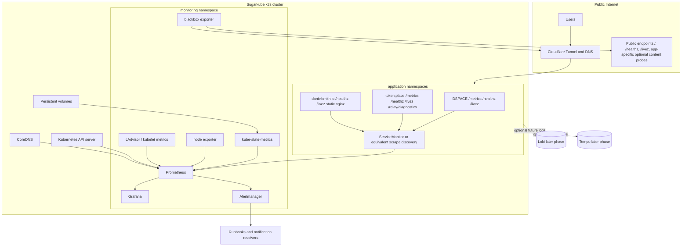

# Sugarkube observability design

This is the canonical, implementation-ready design for Sugarkube observability across the Raspberry Pi k3s platform and the public Sugarkube applications: DSPACE, token.place, danielsmith.io, and jobbot3000. It reconciles the earlier implementation prompt in [`docs/prompts/codex/observability.md`](./prompts/codex/observability.md): that prompt is useful bootstrap context, but this document is the source of truth for phased productionization, ownership, privacy, release gates, and current-state claims.

This document is the design contract. The repository now includes Flux-managed observability manifests for kube-prometheus-stack, Loki/Promtail, and a pinned prometheus-blackbox-exporter release plus Prometheus Operator Probe resources; those source manifests are still not live deployment evidence until verified on a real cluster.

## Audit scope and evidence

Local Sugarkube sources audited:

- [`README.md`](../README.md), [`docs/index.md`](./index.md), [`docs/app_deployment_contract.md`](./app_deployment_contract.md), [`docs/pi_image_telemetry.md`](./pi_image_telemetry.md), and [`docs/prompts/codex/observability.md`](./prompts/codex/observability.md).
- Existing platform manifests in [`platform/`](../platform/), especially [`platform/observability/`](../platform/observability/) and [`platform/cloudflared/`](../platform/cloudflared/).
- Pi image compose/cloud-init files in [`scripts/cloud-init/`](../scripts/cloud-init/), especially built-in exporter containers and Grafana Agent Flow config.
- App runbooks in [`docs/apps/dspace.md`](./apps/dspace.md), [`docs/apps/tokenplace.md`](./apps/tokenplace.md), [`docs/apps/tokenplace-relay.md`](./apps/tokenplace-relay.md), and [`docs/apps/danielsmith.md`](./apps/danielsmith.md).

External public `main` branches audited on 2026-06-19:

- `democratizedspace/dspace`: Dockerfile healthcheck, `infra/metrics.mjs`, `infra/docker/entrypoint.mjs`, `infra/monitoring/`, `charts/dspace/`, `.github/workflows/ci-image.yml`, `.github/workflows/ci-helm.yml`, and release/runbook docs.
- `futuroptimist/token.place`: relay/server sources, health/diagnostics paths, chart, workflows, tests, and E2EE documentation.
- `futuroptimist/danielsmith.io`: nginx runtime Dockerfile/config, `charts/danielsmith/`, GitHub metrics cache sidecar template, `/runtime/github-metrics.json` docs/tests, and image/chart workflows.

Links to external repositories are intentionally file-level or path-level links because this repository should remain the canonical Sugarkube contract while each app repository owns its implementation details.

## 1. Goals and non-goals

### Goals

- Provide a practical learning path from first Prometheus/Grafana exposure to a production-ready observability baseline for a small k3s cluster.
- Cover cluster, application, dependency, release, and public availability signals.
- Fit Raspberry Pi and SBC constraints: single-replica Prometheus first, bounded scrape intervals, explicit retention, small dashboards, and no assumption of excess IOPS or RAM.
- Create a clean cross-repository contract that app teams can implement without changing Sugarkube deployment conventions.
- Make staging data the source for final thresholds; thresholds below are provisional until real measurements exist.
- Produce evidence strong enough to justify listing Prometheus or Grafana as resume skills only after real deployments, dashboards, alerts, drills, runbooks, and release notes exist.

### Non-goals

- This document does not claim Daniel has production Prometheus or Grafana operating experience yet.
- Loki, Tempo, long-term object storage, multi-cluster federation, public Grafana access, kiosk mode, and a GitHub metrics exporter are later phases unless a future audit proves they are required immediately.
- GitHub repository statistics are product/content signals and release evidence; they are not substitutes for service health, latency, error, saturation, or dependency observability.

## 2. Current-state inventory

| Area | Implemented and tested | Documented but not verified | Planned | Explicitly out of scope now |
| --- | --- | --- | --- | --- |
| Sugarkube cluster and Pi image | Pi image compose includes node exporter, cAdvisor, Grafana Agent, and Netdata containers, with Grafana Agent aggregating node and cAdvisor metrics to `:12345`; docs mention scraping `:9100`, `:12345`, and Netdata `:19999` ([compose](../scripts/cloud-init/docker-compose.yml), [Flow config](../scripts/cloud-init/observability/grafana-agent.river), [telemetry docs](./pi_image_telemetry.md), [projects compose](./projects-compose.md)). The Pi telemetry publisher is opt-in and anonymizes stable identifiers before posting verifier summaries ([telemetry docs](./pi_image_telemetry.md)). | Flux-style `platform/observability` manifests define kube-prometheus-stack, Loki, and Promtail with Prometheus retention/storage values and Alertmanager `null-receiver`, but this audit did not verify those manifests are deployed on a live cluster ([HelmRelease](../platform/observability/kube-prometheus-stack.yaml), [values](../platform/observability/kube-prometheus-stack-values.yaml), [Loki](../platform/observability/loki.yaml)). | Use kube-prometheus-stack as the k3s foundation, add blackbox exporter, ServiceMonitor discovery, shared dashboards, and alert routes. | Installing runtime components in this PR; claiming production Grafana/Prometheus operations experience before release evidence exists. |
| DSPACE | Public app repo has `/healthz` and `/livez` health endpoints, Docker healthcheck, Helm chart probes, image/chart workflows, and a local Docker Compose Prometheus/Grafana monitoring scaffold. The dedicated `infra/metrics.mjs` listener is enabled separately and currently serves `/metrics` without bearer-token enforcement; the documented DSPACE `METRICS_TOKEN` and ServiceMonitor bearer-token intent must not be treated as verified protection for that dedicated metrics port until DSPACE implements and tests it. The metrics port must be protected by Kubernetes network policy, cluster-only Service exposure, ingress rules, or an application-side auth change before use outside trusted local monitoring ([DSPACE Dockerfile](https://github.com/democratizedspace/dspace/blob/main/Dockerfile), [metrics server](https://github.com/democratizedspace/dspace/blob/main/infra/metrics.mjs), [monitoring README](https://github.com/democratizedspace/dspace/tree/main/infra/monitoring), [chart](https://github.com/democratizedspace/dspace/tree/main/charts/dspace)). Sugarkube runbooks verify `/config.json`, `/healthz`, and `/livez` ([runbook](./apps/dspace.md), [app contract](./app_deployment_contract.md)). | Metrics endpoint behavior was verified from source, not by hitting a deployed DSPACE pod. Existing monitoring scaffold is local/app-owned and not proof of Sugarkube production Prometheus. | DSPACE v3.1.0 should add/confirm bounded dChat metrics, release labels, dashboard panels, alerts, and privacy guardrails. | Recording prompts, answers, player save data, inventory, user identity, or unbounded errors in metrics/logs. |
| token.place | Sugarkube runbooks document `/`, `/livez`, `/healthz`, `/relay/diagnostics`, `/api/v1/meta`, and the required real relay-compute staging/prod evidence ([runbook](./apps/tokenplace.md), [onboarding](./tokenplace_sugarkube_onboarding.md)). The app repo includes Helm/image workflow support and E2EE relay design constraints in code/docs (audited from `futuroptimist/token.place` main). | This audit verified source-level endpoints and logging patterns but did not prove any metrics endpoint is scraped in Sugarkube staging/prod. Existing diagnostics are necessary but not sufficient for production relay health. | token.place v0.1.2 should add/confirm API/relay metrics, queue/lease/node gauges, release labels, ServiceMonitor hooks, dashboards, and alerts while preserving relay-blind E2EE. | Reviving legacy relay endpoints, API v1 streaming, plaintext prompts/responses, ciphertext payloads, keys, auth headers, or user identifiers in observability data. |
| danielsmith.io | App repo serves a static Vite/Three.js site from nginx, exposes `/livez` and `/healthz`, has Helm chart probes, image/chart workflows, and an optional sidecar that writes public GitHub project metadata to `/runtime/github-metrics.json` ([release runbook](https://github.com/futuroptimist/danielsmith.io/blob/main/docs/ops/sugarkube-release.md), [Dockerfile](https://github.com/futuroptimist/danielsmith.io/blob/main/Dockerfile), [chart](https://github.com/futuroptimist/danielsmith.io/tree/main/charts/danielsmith), [cache template](https://github.com/futuroptimist/danielsmith.io/blob/main/charts/danielsmith/templates/github-metrics-cache-configmap.yaml)). Sugarkube documents manual staging/prod checks for `/runtime/github-metrics.json` ([runbook](./apps/danielsmith.md)). | Runtime cache and client telemetry hooks were verified from source/tests, not by a live public probe during this audit. | danielsmith.io v0.1.0 should be covered by blackbox probes, pod/resource panels, release/image identity, and later privacy-reviewed browser performance/failover telemetry. | Treating GitHub stars/cache as operational metrics; collecting browser telemetry before privacy review. |
| Cloudflare ingress/tunnels | `platform/cloudflared` values enable Cloudflared metrics and route `apps.sugarkube.dev` to Traefik, while serviceMonitor is disabled ([config](../platform/cloudflared/configmap.yaml)). Cloudflare runbooks document metrics/ready port checks ([tunnel runbook](./cloudflare_tunnel.md)). | This audit did not verify live Cloudflare tunnels, DNS, Access policies, or public endpoint success. | Add blackbox probes for public URLs, Cloudflare tunnel metrics scraping when enabled, TLS expiry panels, and runbooks for separating DNS/tunnel failures from app releases. | Managing Cloudflare/DNS from app Helm charts; public Prometheus; public Grafana until an explicit later phase with Zero Trust. |
| GitHub Actions and release artifacts | App runbooks link image and chart workflows/packages for each flagship app, and app repos have image/chart workflows that publish immutable GHCR artifacts when conditions are met ([README app section](../README.md), [DSPACE workflows](https://github.com/democratizedspace/dspace/tree/main/.github/workflows), [token.place workflows](https://github.com/futuroptimist/token.place/tree/main/.github/workflows), [danielsmith workflows](https://github.com/futuroptimist/danielsmith.io/tree/main/.github/workflows)). | Workflow existence and source logic do not prove a specific artifact was deployed or is healthy. | Include release/build labels in app metrics and dashboard annotations; require release QA evidence per app. | Using stars, issue counts, or last workflow status as service uptime/SLO substitutes. |

## 3. Ownership boundaries

### Application repositories own

- Application `/metrics` endpoints and instrumentation libraries.
- Bounded metric labels, safe route/outcome/status-class dimensions, and histogram buckets.
- `/healthz`, `/livez`, readiness/liveness semantics, and any safe app diagnostics endpoint.
- Release/build identity exposed as labels and/or a low-cardinality `*_build_info` metric.
- Container images and Helm chart settings that expose Prometheus scrape hooks, such as `Service`, annotations, or optional `ServiceMonitor` templates.
- App-specific runbooks and release QA evidence.
- Privacy guarantees for payloads, prompts, save data, keys, ciphertext, and user identifiers.

### Sugarkube owns

- Prometheus, Grafana, Alertmanager, blackbox exporter, kube-state-metrics, node/container metrics, and shared dashboard deployment.
- Environment configuration, namespace layout, ServiceMonitor/PodMonitor discovery policy, blackbox target lists, alert routing, retention, storage budgets, and cluster runbooks.
- Cross-application dashboard conventions, severity labels, and release evidence requirements.
- Public endpoint probing and TLS expiry monitoring.

### Boundaries that must stay explicit

- Cloudflare tunnels, Cloudflare Access, DNS, and certificate issuance are platform/networking concerns, not Helm application release concerns.
- GitHub workflow/package status and GitHub project statistics can explain release provenance or product interest, but they are not service observability.

## 4. Proposed architecture

### Namespaces

- `monitoring`: Prometheus, Grafana, Alertmanager, blackbox exporter, kube-state-metrics, node/container metric components, and optional future Loki/Tempo components.
- `dspace`, `tokenplace`, `danielsmith`: application releases and app-owned Services.
- `cloudflared`, `cert-manager`, `kube-system`, storage namespaces: platform dependencies scraped or probed by Sugarkube-owned rules.

### Service discovery

- Use the existing `monitoring` namespace and kube-prometheus-stack discovery as the default Sugarkube design.
- ServiceMonitors should keep the current kube-prometheus-stack release-label convention, such as `release: kube-prometheus-stack`, unless a future runtime PR intentionally migrates Prometheus selector values.
- A custom selector label, for example `sugarkube.dev/monitor: "true"`, is only a later migration option and would require a platform values change before it becomes the contract.
- App-owned ServiceMonitors for `dspace`, `tokenplace`, and `danielsmith` should use a `namespaceSelector` that names the corresponding app namespace, or an equivalent platform-owned selector that is explicit about those namespaces.
- If an app namespace or the `monitoring` namespace has default-deny ingress or egress NetworkPolicies, include both app-side ingress from `monitoring` and monitoring-side egress to the app metrics Service/port before treating the target as release-ready.
- App charts may render scrape hooks, but Sugarkube decides which environments and namespaces Prometheus discovers.
- Where app charts cannot yet render ServiceMonitors, use a temporary Sugarkube-owned static scrape config with an explicit follow-up to move hooks into the app repo.

### Retention and resource budget

- Start with one Prometheus replica, 15 days retention, and a small persistent volume; the existing values use `15d` and `50Gi` as a starting point ([values](../platform/observability/kube-prometheus-stack-values.yaml)).
- Keep default scrape intervals at 30-60 seconds for application metrics and 60 seconds for low-change blackbox/TLS probes unless staging data proves tighter intervals are necessary.
- Prefer fewer, high-value metrics over broad per-request dimensions.
- Review Prometheus memory, WAL growth, and PV usage after staging soak before production.

### Persistent storage

- Prometheus and Grafana need persistent volumes in staging/prod.
- Alerts should treat PV exhaustion and Prometheus write failures as observability-stack risks, not app outages.
- If the monitoring PV is unavailable, app traffic must continue; the failure mode is loss of visibility, not application rollback.

### Staging versus production

- Staging and production must have distinct `environment` labels and dashboards can use variables to switch.
- Staging establishes latency, error-rate, restart, queue, and blackbox baselines before production alert thresholds are finalized.
- Production alerts start conservative and actionable; noisy alerts are disabled until the operator has a mitigation path.

### Observability stack failure behavior

- If Prometheus is down, applications keep serving traffic and app release automation must not rebuild or redeploy merely because dashboards are dark.
- If Grafana is down, use Prometheus UI or `kubectl`/blackbox runbook commands as fallback.
- If Alertmanager delivery is down, alerts are visible in Prometheus but notifications may be lost; route only actionable signals once delivery is tested.

### Public blackbox monitoring runtime slice

The first runtime slice is implemented in source under [`platform/observability`](../platform/observability/) and [`monitoring/probes`](../monitoring/probes/). It installs `prometheus-blackbox-exporter` as a pinned Flux HelmRelease and defines Prometheus Operator `Probe` resources for committed staging and production public URLs. See [`docs/observability-blackbox.md`](./observability-blackbox.md) for the module, label, active-target, omission, PromQL, and troubleshooting contract. These manifests are desired state only; live deployment evidence must come from cluster verification after reconciliation.

## 5. Metrics and labeling contract

### Naming

- Use Prometheus naming conventions: `<app>_<domain>_<measurement>_<unit>` for counters/gauges/histograms where an app prefix avoids collisions.
- Counters end in `_total`; seconds use `_seconds`; bytes use `_bytes`; build info is a gauge with value `1`.
- Examples: `dspace_http_requests_total`, `dspace_dchat_request_duration_seconds`, `tokenplace_relay_queue_depth`, `tokenplace_compute_nodes_healthy`, `danielsmith_build_info`.

### Required common labels

Every application metric exposed to Sugarkube must include, by direct label or Prometheus relabeling:

- `app`: `dspace`, `tokenplace`, or `danielsmith`.
- `environment`: `dev`, `staging`, or `prod`.
- `cluster`: stable cluster name, initially `sugarkube` unless environment-specific names are introduced.
- `namespace`: Kubernetes namespace.
- `release`: Helm release or immutable application release identifier.

### Bounded labels

- HTTP route labels must be templates or route groups, not raw URLs: `/api/v1/chat/completions`, `/healthz`, `/relay/diagnostics`, `static`, `unknown`.
- Status labels should use `status_class` (`2xx`, `3xx`, `4xx`, `5xx`) and optionally bounded `status_code` only where useful.
- Outcome labels must be enumerations such as `success`, `timeout`, `rate_limited`, `dependency_failure`, `cancelled`, `validation_error`, `content_policy`, `unknown_error`.
- Dependency labels must be a bounded service name such as `tokenplace`, `github_api`, `openai`, `cloudflare`, or `compute_node_pool`.

### Histograms

- Use seconds histograms for request/dependency latency.
- Start with coarse buckets appropriate for Pi clusters and public HTTP: `0.05`, `0.1`, `0.25`, `0.5`, `1`, `2.5`, `5`, `10`, `30` seconds.
- Use separate histograms for external inference latency if it has much slower tails than local HTTP.

### Cardinality limits

- New app metrics should target fewer than 100 active time series per app/environment unless explicitly reviewed.
- Do not add labels whose value count grows with users, sessions, requests, prompts, files, arbitrary errors, URLs, model lists, or compute-node identifiers.

### Prohibited labels and payloads

Metrics, logs used for dashboards, and alerts must not contain:

- User identifiers.
- IP addresses.
- Request IDs as metric labels.
- Prompts or responses.
- Player save data or inventory.
- API keys, cryptographic keys, ciphertext, or authentication headers.
- Unbounded URLs, exception text, model names, or arbitrary error strings as labels.

## 6. Platform SLIs and candidate alerts

These are provisional until staging data establishes normal behavior. They are not SLOs.

| SLI / alert | Signal | Provisional threshold | Window | Notes |
| --- | --- | --- | --- | --- |
| Node readiness | `kube_node_status_condition{condition="Ready"}` | any prod node NotReady | 10m | Check power, SD/SSD, network, k3s. |
| Disk pressure | kube node disk pressure, filesystem free | pressure true or <10% free | 15m | Avoid paging if only old image cache cleanup is needed. |
| Memory pressure | kube node memory pressure | pressure true | 10m | Check workloads and kubelet eviction. |
| API server health | apiserver `up`, `/readyz` blackbox if configured | down | 5m | Cluster-wide control-plane issue. |
| DNS health | CoreDNS pod readiness and DNS probe | failures >5m | 5m | Breaks app dependency lookups. |
| Pod restarts/crash loops | restart increase, waiting reason | >3 restarts in 15m or CrashLoopBackOff | 15m | Route to app or platform owner by namespace. |
| Deployment readiness | available replicas below desired | <100% desired | 10m | Actionable for app rollback when app-specific. |
| PV health | PVC pending, PV filesystem near full | pending >10m or <15% free | 15m | Longhorn/NFS runbook first. |
| Public endpoint success | `probe_success` | 0 | 5m staging, 3m prod | Separate app and Cloudflare/DNS causes. |
| Public latency | `probe_duration_seconds` | p95 >2s for static, >5s app/API | 15m | Tune with staging baseline. |
| TLS expiry | `probe_ssl_earliest_cert_expiry` | <14d warning, <3d critical | 1h | Cert-manager/Cloudflare runbook. |
| Prometheus scrape health | `up{job=...}` | app/platform scrape down | 10m | Not always user-impacting; warn first. |
| Alertmanager delivery | Alertmanager notification failures | failures >0 sustained | 15m | Do not page through broken route. |

## 7. DSPACE-specific story

### Verified current behavior

DSPACE has `/healthz` and `/livez` support in Docker/Helm/runbooks, release workflows for GHCR image and chart publication, and an app-local `/metrics` implementation and monitoring scaffold in the public repo. Sugarkube currently verifies `/config.json`, `/healthz`, and `/livez` through app runbooks and the shared app contract.

### Design requirements for DSPACE v3.1.0 release gate

Minimum gate for DSPACE v3.1.0:

- `/metrics` is enabled in staging and prod only after one concrete safe scrape strategy is implemented and verified: either endpoint-level auth is actually implemented in DSPACE and the ServiceMonitor bearer-token Secret wiring is documented/tested, or the metrics port is cluster-only through Service/NetworkPolicy controls and Prometheus scrape access from the `monitoring` namespace is verified. Do not expose `/metrics` publicly based on an unverified `METRICS_TOKEN` assumption.
- HTTP metrics: request count, duration, status class, method, bounded route, and bounded outcome.
- Public availability: blackbox probes for `https://staging.democratized.space/`, `/config.json`, `/healthz`, `/livez`, and production equivalents.
- dChat metrics: request count, request duration, outcome, timeout count, rate-limit count, dependency-failure count, and safe provider/dependency category. Do not label by prompt, response, user, session, model name, raw route, exception, save data, inventory, or request ID.
- token.place dependency health: success/latency/outcome for calls from DSPACE to token.place, if/when token.place is the backend for dChat.
- Process/runtime health: pod readiness, restarts, CPU/memory, event-loop/runtime saturation if available safely.
- Release/build identity: `dspace_build_info{version,revision,release,environment}` or equivalent low-cardinality labels.
- SSR/hydration failures: collect only if safely measurable as bounded counters, such as `dspace_client_hydration_errors_total{route_group,outcome}`; no client payloads or stack traces.
- Dashboard: DSPACE public availability, app HTTP latency/error rate, dChat success/latency/outcomes, token.place dependency health, pod health, and release identity.
- Alert set: public down, elevated `5xx`, dChat dependency failures, scrape down, crash loop, and release mismatch only when each has an operator action.
- Privacy: chat content, save data, inventory, user identity, API keys, ciphertext, and auth headers must never enter metrics, labels, dashboards, alerts, or routine logs.

## 8. token.place-specific story

### Verified current behavior

Sugarkube runbooks require health and relay diagnostic checks and explicitly state that generic HTTP/TLS readiness does not prove the real relay-compute path. The public repo has Helm/image release scaffolding and relay-blind E2EE design constraints; this audit did not verify a production Prometheus scrape.

### Design requirements for token.place v0.1.2 release gate

Minimum gate for token.place v0.1.2:

- Relay/API v1 availability metrics for `/`, `/livez`, `/healthz`, `/relay/diagnostics`, and `/api/v1/meta` where applicable.
- HTTP/API metrics: request rate, latency histogram, status class, bounded route, and bounded outcome.
- Relay queue metrics: queue depth, in-flight requests, cancellations, timeouts, rate-limit rejections, dependency failures, and stale work age.
- Compute-node metrics: registered node count, healthy node count, lease age distribution, stale-node evictions, and last-success age in aggregate. Do not label by node ID unless hashed and explicitly cardinality-reviewed; prefer counts and age buckets.
- Upstream inference metrics: latency, availability, timeout, cancellation, and bounded provider category. Do not add model names as labels.
- State-loss acknowledgement: because accepted in-memory state loss is part of the relay model, dashboards should show pod restarts and queue/node state resets without treating every restart as data corruption.
- Release identity: `tokenplace_build_info{version,revision,release,environment}` or equivalent.
- ServiceMonitor/scrape hook in the chart, enabled by Sugarkube values.
- Dashboard: relay/API availability, queue and lease health, compute-node pool health, upstream inference latency/outcomes, pod restarts, resource saturation, and release identity.
- Alert set: public/API down, no healthy compute nodes while demand exists, queue age/depth high, stale leases not evicted, upstream dependency unavailable, crash loop, and scrape down.
- Relay-blind E2EE invariants: metrics, logs, dashboards, and alerts may include safe routing metadata and bounded outcomes only. They must never contain plaintext prompts/responses, ciphertext, cryptographic keys, auth headers, user identity, or raw payload sizes that can identify a user.

## 9. danielsmith.io-specific story

### Verified current behavior

The app is a static nginx site with `/livez` and `/healthz`, Helm chart probes, GHCR image/chart workflows, a Sugarkube release runbook, and an optional `githubMetricsCache` sidecar that publishes same-origin public GitHub project metadata at `/runtime/github-metrics.json`. Sugarkube docs intentionally keep `/runtime/github-metrics.json` as manual staging/prod verification rather than a shared app verify path. The root `/resume.pdf` URL is a planned v0.1.0 app contract, not verified current behavior; the currently committed dated resume asset path is interim/manual evidence and may be used as a non-paging content check, but it is not a substitute for the root `/resume.pdf` contract.

### Design requirements for danielsmith.io v0.1.0 release gate

Minimum gate for danielsmith.io v0.1.0:

- Blackbox probes for `/`, `/livez`, and `/healthz` in staging and prod. The currently published resume PDF path `/docs/resume/2025-09/resume.pdf` may be checked as interim/manual evidence or a non-paging content probe. Mandatory paging/release-blocking blackbox coverage for root `/resume.pdf` starts only after danielsmith.io serves or redirects that path and the runbook/app contract verifies it.
- TLS expiry and public latency panels/alerts.
- Pod readiness, restarts, CPU/memory, nginx connection/request counters if safely exposed later, and static asset probe success.
- Release/image identity through Kubernetes labels and optionally `danielsmith_build_info` if an app metrics endpoint is introduced.
- Dashboard: public availability, static route latency, TLS expiry, pod health, resource saturation, image tag/revision, and GitHub metrics cache status as product metadata only.
- Browser performance and failover telemetry: later privacy-reviewed phase. Any client telemetry must avoid IP/user identifiers and should aggregate locally before export.
- Distinction: `/runtime/github-metrics.json` and client GitHub repo stats are portfolio/product metadata, not operational service metrics and not a substitute for blackbox, pod, or resource signals.

## 10. Dashboards

| Dashboard | Audience | Rows | Primary questions | Source metrics |
| --- | --- | --- | --- | --- |
| Sugarkube cluster overview | Platform operator | Cluster status, node resources, API/DNS, PV/storage, system pod restarts, observability health | Is k3s healthy? Are Pis constrained? Is monitoring itself working? | kube-state-metrics, node exporter, kubelet/cAdvisor, Prometheus self metrics, Alertmanager metrics |
| Application fleet overview | Release operator | App availability, deployment readiness, scrape health, recent restarts, release versions, public probes | Which app/environment is unhealthy or on the wrong release? | app metrics, kube-state-metrics, blackbox, build info |
| DSPACE | DSPACE owner and Sugarkube operator | Public probes, HTTP latency/errors, dChat outcomes, token.place dependency, pod resources, release | Can players use DSPACE and dChat safely? | DSPACE `/metrics`, blackbox, kube metrics |
| token.place | token.place owner and Sugarkube operator | API/relay health, queue depth/age, compute nodes, leases, upstream inference, E2EE invariant notes, pod health | Can relay/API v1 complete work without violating privacy? | token.place `/metrics`, blackbox, kube metrics |
| danielsmith.io | Site owner and Sugarkube operator | Public probes, TLS, static paths, pod/resources, release/image, GitHub metadata cache | Is the portfolio reachable, fast, and serving the intended artifact? | blackbox, kube metrics, optional nginx/app metrics, runtime cache checks |
| jobbot3000 | Site owner and Sugarkube operator | Staging public probes, static tracker page, pod/resources, release/image | Is the browser-local tracker reachable and serving the intended static app? | blackbox, kube metrics |
| External availability and TLS | Platform/network operator | Endpoint matrix, DNS/Cloudflare path, TLS expiry, probe latency by region if available | Is the public route broken, expiring, or slow? | blackbox exporter, Cloudflare metrics when enabled |

## 11. Alerts and runbooks

| Alert | Severity | Signal | Provisional threshold | Window | Likely causes | Runbook location | Mitigation / rollback |
| --- | --- | --- | --- | --- | --- | --- | --- |
| `NodeNotReady` | critical | node readiness | any prod node NotReady | 10m | power, network, k3s, storage | `docs/raspi_cluster_troubleshooting.md` | restore node/power/network; cordon/drain if needed |
| `DeploymentUnavailable` | warning/critical by app | available replicas | desired not met | 10m | bad image, failing probes, quota | app runbook under `docs/apps/` | rollback to previous immutable tag |
| `PodCrashLooping` | warning | restart increase/CrashLoopBackOff | >3 restarts | 15m | app bug, bad config, dependency | app runbook under `docs/apps/` | inspect logs/events; rollback if release-related |
| `PublicEndpointDown` | critical for prod, warning for staging | `probe_success` | 0 | 3-5m | app down, ingress, DNS, Cloudflare | `docs/cloudflare_tunnel.md`, app runbook | isolate Cloudflare vs app; rollback app only if app cause |
| `TLSExpiringSoon` | warning/critical | cert expiry | <14d / <3d | 1h | cert-manager, Cloudflare DNS/API | `docs/cloudflare_tunnel.md`, cert-manager docs | renew/fix issuer/DNS; no app rollback |
| `PrometheusScrapeDown` | warning | `up == 0` | scrape down | 10m | ServiceMonitor mismatch, app metrics disabled | this design + app runbook | fix scrape hook; do not page if app is healthy |
| `AlertmanagerDeliveryFailed` | warning | notification failures | >0 sustained | 15m | receiver secret/config/network | future `docs/runbooks/alertmanager.md` | fix receiver; verify test alert |
| `DspaceDchatDependencyFailures` | warning | dChat outcome | dependency failures above baseline | 15m | token.place/downstream failures | `docs/apps/dspace.md`, `docs/apps/tokenplace.md` | fallback path or rollback related release |
| `TokenplaceNoHealthyComputeNodes` | critical when demand exists | healthy nodes and queued work | healthy nodes 0 and queue >0 | 5m | compute nodes offline, relay registration broken | `docs/apps/tokenplace.md` | restart/register compute node; rollback relay if release-related |
| `TokenplaceQueueBacklog` | warning | queue age/depth | p95 age >60s or depth above staging baseline | 15m | insufficient compute, upstream slow | `docs/apps/tokenplace.md` | add/restart compute; rate-limit; rollback if regression |
| `DanielsmithStaticProbeFailed` | warning/critical | blackbox path probes | `/` fails now; `/resume.pdf` only after the v0.1.0 root resume contract is implemented and verified | 5m | nginx/static asset/ingress issue | `docs/apps/danielsmith.md` | rollback image/tag; fix ingress if shared |

Do not page on symptoms without a response path, such as low traffic, GitHub stars changing, or a single transient staging probe failure.

## 12. Phased rollout

1. **Inventory and naming contract**: finalize metric names, labels, privacy rules, and app release gates. Can proceed in parallel with app repo implementation planning.
2. **Cluster monitoring foundation**: deploy/verify kube-prometheus-stack in staging, resource requests, retention, PV, Grafana, Alertmanager null/test receiver. Depends on platform capacity and storage.
3. **Blackbox monitoring**: add public probes for app endpoints and TLS. Can proceed before app `/metrics` endpoints are complete.
4. **Application scrape integration**: app repos expose safe metrics and chart scrape hooks; Sugarkube enables discovery per environment. Depends on each app release gate.
5. **Dashboards**: build the six small dashboards above, starting with cluster and external availability, then app-specific dashboards as metrics arrive.
6. **Alerts**: enable only actionable alerts with runbook links and tested delivery. Depends on dashboards and staging baseline.
7. **Staging failure drills**: rehearse endpoint down, crash loop, scrape down, TLS warning, token.place no-compute-node, and Alertmanager delivery checks.
8. **Production rollout**: promote the monitoring stack and app scrape hooks after staging soak and drill evidence.
9. **Post-release baseline review**: after at least one production week, adjust thresholds, retention, dashboard rows, and noisy alerts based on measured data.

Parallel work:

- App repos can implement metrics contracts while Sugarkube deploys blackbox monitoring.
- Dashboard JSON can be drafted from metric names before production data, but panels are not marked complete until backed by real metrics.
- Runbooks can be drafted before alerts, but alerts remain disabled until mitigation steps are verified.

## 13. Release evidence before listing Prometheus/Grafana as resume skills

Prometheus or Grafana should not be listed as production skills until evidence exists for all of the following:

- Successful staging and production deployments of the observability stack.
- Dashboards backed by real Prometheus metrics, not placeholders or mock data.
- At least one tested alert path through Alertmanager to the chosen receiver.
- At least one documented failure drill or real incident with timeline, diagnosis, mitigation, and follow-up.
- Operator runbooks for cluster, app, blackbox/TLS, Prometheus, Grafana, and Alertmanager failures.
- Release notes or QA evidence from DSPACE v3.1.0, token.place v0.1.2, and danielsmith.io v0.1.0 showing their metrics/privacy/dashboard/alert gates were met.

## Open questions

- Which cluster names should distinguish staging and production if both run on Sugarkube-managed hardware?
- Should app metrics endpoints use bearer tokens, network policy only, or both?
- What Alertmanager receiver is acceptable for first production use: email, Slack, Matrix, GitHub issue, or another private channel?
- What Prometheus PV size is realistic after a one-week staging soak on the target Pi hardware?
- Should Loki remain entirely deferred, or should minimal log labels be designed now without deploying Loki?
