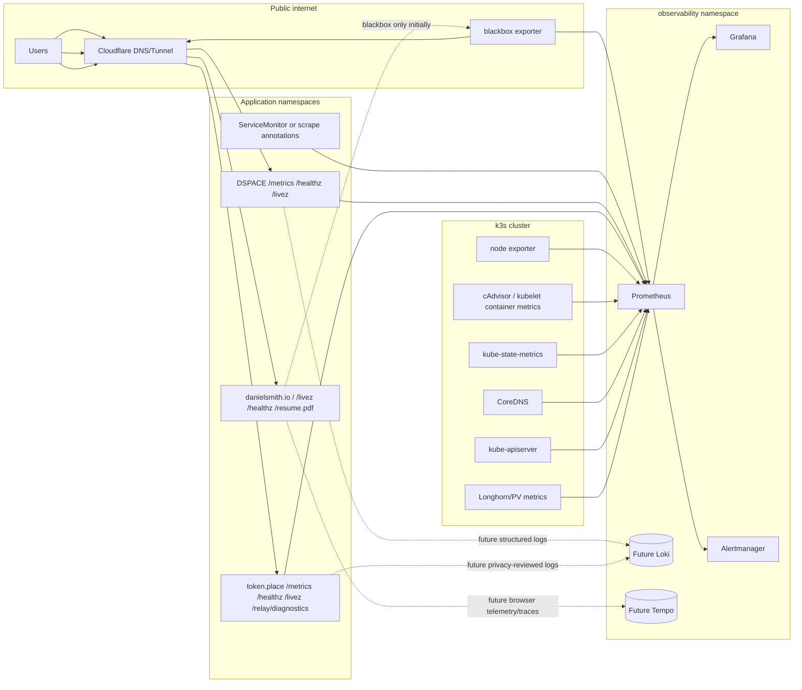

# Sugarkube observability design

This is the canonical implementation-ready observability design for Sugarkube and the flagship applications DSPACE, token.place, and danielsmith.io. It supersedes the older implementation prompt in [docs/prompts/codex/observability.md](prompts/codex/observability.md) by separating what is already implemented from what should be built next. The prompt remains useful as historical scaffolding input, but this document is the source of truth for scope, privacy, ownership, dashboards, alerts, and release gates.

This is a design and documentation artifact only. It does not install Prometheus, Grafana, Loki, exporters, dashboards, Helm values, runtime manifests, or application dependencies.

## Audit basis

Claims below were checked against this Sugarkube repository plus the public `main` branches of:

- [democratizedspace/dspace](https://github.com/democratizedspace/dspace)
- [futuroptimist/token.place](https://github.com/futuroptimist/token.place)
- [futuroptimist/danielsmith.io](https://github.com/futuroptimist/danielsmith.io)

The audit intentionally treats source scaffolding, chart support, and runbook text as different evidence classes. A feature is not listed as deployed just because a chart template, workflow, or runbook mentions it.

## Goals

- Provide a practical path for learning Prometheus and Grafana while moving toward production-grade Sugarkube operations.
- Cover cluster, application, dependency, and external availability signals for a small k3s cluster running on Raspberry Pis and other SBCs.
- Reuse the existing GHCR-first application deployment contract, environment values, and app runbooks instead of creating a parallel deployment path.
- Define application metrics and label contracts that are safe for privacy-sensitive apps and low-cardinality enough for a small cluster.
- Make blackbox public endpoint checks a first-class signal for Cloudflare Tunnel, DNS, TLS, and ingress behavior.
- Define staged release evidence before Prometheus or Grafana may be claimed as operating experience.

## Non-goals

- This document does not claim that Daniel has production Prometheus or Grafana operating experience yet.
- This document does not deploy or configure runtime observability components.
- Loki, Tempo, long-term object storage, multi-cluster federation, and public Grafana access are later phases unless a future audit proves they are required sooner.
- GitHub repository statistics are not service observability. They may remain product/content signals, but they must not replace health, scrape, latency, error, or alert evidence.
- Cloudflare DNS and Tunnel routing remain separate from Helm application deployment.

## Current-state inventory

| Area | Implemented and tested | Documented but not verified as deployed | Planned | Explicitly out of scope now |
| --- | --- | --- | --- | --- |
| Sugarkube cluster and Pi image | The Pi image build documentation says node exporter, cAdvisor, Grafana Agent, and Netdata containers are shipped; quick-start docs describe checking node exporter on `:9100` and the aggregated Grafana Agent feed on `:12345`; cloud-init includes opt-in first-boot telemetry and compose entries for Grafana Agent and Netdata. Sources: [README.md](../README.md), [docs/pi_image_quickstart.md](pi_image_quickstart.md), [docs/pi_image_telemetry.md](pi_image_telemetry.md), [scripts/cloud-init/docker-compose.yml](../scripts/cloud-init/docker-compose.yml), [scripts/cloud-init/user-data.yaml](../scripts/cloud-init/user-data.yaml). | Older platform/runbook docs mention `kube-prometheus-stack`, Loki, and Promtail in the `monitoring` namespace, and the archived checklist marks lightweight observability exporters as done. These are not treated as proof of current production deployment. Sources: [docs/runbook.md](runbook.md), [docs/cluster-rollout-and-migrations.md](cluster-rollout-and-migrations.md), [docs/archived/pi_image_improvement_checklist.md](archived/pi_image_improvement_checklist.md). | Standardize a Prometheus/Grafana foundation, ServiceMonitor discovery, blackbox checks, dashboard set, and alert routing. | Installing runtime components in this PR; claiming production experience before evidence exists. |
| DSPACE | Public app repo has `/livez`, `/healthz`, and a `prom-client` `/metrics` server copied into the image; Docker health check hits `/healthz`; docs describe structured JSON logs and optional protected metrics; chart has liveness/readiness probes and GHCR/Helm workflows. Sources: [DSPACE Dockerfile](https://github.com/democratizedspace/dspace/blob/main/Dockerfile), [DSPACE metrics server](https://github.com/democratizedspace/dspace/blob/main/infra/metrics.mjs), [DSPACE config docs](https://github.com/democratizedspace/dspace/blob/main/docs/config.md), [DSPACE chart values](https://github.com/democratizedspace/dspace/blob/main/charts/dspace/values.yaml), [DSPACE image workflow](https://github.com/democratizedspace/dspace/blob/main/.github/workflows/ci-image.yml), [DSPACE chart workflow](https://github.com/democratizedspace/dspace/blob/main/.github/workflows/ci-helm.yml), [Sugarkube DSPACE runbook](apps/dspace.md). | DSPACE docs describe ServiceMonitor behavior, metrics tokens, and integration environment scraping, but the audited chart `templates/` did not include a ServiceMonitor template on `main`; therefore scrape integration is documented but not verified as chart-rendered. Source: [DSPACE config docs](https://github.com/democratizedspace/dspace/blob/main/docs/config.md). | DSPACE v3.1.0 release gate for bounded app metrics, dChat metrics, token.place dependency health, and dashboard/alerts. | Metrics or logs containing chat content, player save data, inventory, user identity, prompts, or responses. |
| token.place | Public app repo image workflow smoke-tests `/livez`, `/healthz`, `/relay/diagnostics`, and `/metrics`; runbooks state `/metrics` exists but is not sufficient for relay sign-off; Helm chart has liveness/readiness probes; release workflows publish image and chart artifacts; architecture docs define relay-blind E2EE constraints. Sources: [token.place image workflow](https://github.com/futuroptimist/token.place/blob/main/.github/workflows/ci-image.yml), [token.place chart](https://github.com/futuroptimist/token.place/tree/main/charts/tokenplace), [token.place relay onboarding](https://github.com/futuroptimist/token.place/blob/main/docs/relay_sugarkube_onboarding.md), [token.place API v1 E2EE architecture](https://github.com/futuroptimist/token.place/blob/main/docs/architecture/api_v1_e2ee_relay.md), [Sugarkube token.place runbook](apps/tokenplace.md). | The repository has diagnostics and test docs for queue depth, compute-node registration, lease expiry, and desktop parity, but the audit did not verify live deployment state. Sources: [token.place testing docs](https://github.com/futuroptimist/token.place/blob/main/docs/TESTING.md), [token.place desktop parity checklist](https://github.com/futuroptimist/token.place/blob/main/docs/desktop_parity_validation.md). | token.place v0.1.2 release gate for bounded Prometheus metrics, structured logging review, dashboards, alerts, and relay-blind privacy invariants. | Multi-replica stateful relay redesign, plaintext payload observability, API v1 streaming revival, and logs/metrics that expose ciphertext or authentication headers. |
| danielsmith.io | Public app repo is a static Vite/Three.js site served by nginx, with `/livez` and `/healthz`; tests start the container and verify those endpoints; Helm chart has probes, static service, and optional GitHub metrics cache sidecar; workflows publish image and chart artifacts. Sources: [danielsmith.io release runbook](https://github.com/futuroptimist/danielsmith.io/blob/main/docs/ops/sugarkube-release.md), [danielsmith.io tests workflow](https://github.com/futuroptimist/danielsmith.io/blob/main/.github/workflows/02-tests.yml), [danielsmith.io chart](https://github.com/futuroptimist/danielsmith.io/tree/main/charts/danielsmith), [Sugarkube danielsmith.io runbook](apps/danielsmith.md). | Browser performance diagnostics and client telemetry hooks exist in the app source/docs, and the runtime GitHub metrics cache is documented for staging/prod, but these are product/runtime content signals rather than Prometheus service metrics. Sources: [danielsmith.io performance budgets](https://github.com/futuroptimist/danielsmith.io/blob/main/docs/architecture/performance-budgets.md), [danielsmith.io scene stack](https://github.com/futuroptimist/danielsmith.io/blob/main/docs/architecture/scene-stack.md). | danielsmith.io v0.1.0 release gate for public blackbox checks, pod readiness/restarts, resource saturation, release identity, and later privacy-reviewed browser telemetry. | In-cluster API, queue, database, compute node, or operational meaning for GitHub stars/forks. |
| Cloudflare ingress/tunnels | Sugarkube has cloudflared manifests with metrics configuration; docs include ready/metrics port-forward checks and state that Cloudflare responsibilities sit outside Helm app deployment. Sources: [platform/cloudflared/configmap.yaml](../platform/cloudflared/configmap.yaml), [docs/cloudflare_tunnel.md](cloudflare_tunnel.md), [docs/app_deployment_contract.md](app_deployment_contract.md). | Public endpoint health depends on external Cloudflare/DNS state that is not proven by Helm templates. | Blackbox exporter probes for each public URL and TLS expiry alerts. | Managing Cloudflare DNS or Tunnel routing inside app Helm charts. |
| GitHub Actions and release artifacts | Sugarkube and the three app repos have image/chart/release workflows and app runbooks requiring immutable tags, chart pins, rollout status, public path checks, and release evidence. Sources: [docs/app_deployment_contract.md](app_deployment_contract.md), [docs/apps/dspace.md](apps/dspace.md), [docs/apps/tokenplace.md](apps/tokenplace.md), [docs/apps/danielsmith.md](apps/danielsmith.md). | Public workflow pages prove workflow definitions and past runs when visible, but this design does not assert any current production deployment from workflow existence alone. | Add observability evidence to release QA for each flagship app. | Treating GitHub stars, open issues, or workflow badges as service availability. |

## Ownership boundaries

### Application repositories own

- Application metrics exposed on `/metrics` or an equivalent internal endpoint.
- Bounded labels and safe metric names.
- `/livez`, `/healthz`, and any safe diagnostics endpoint.
- Release/build identity surfaced through labels, `/metrics`, `/api/v1/meta`, config, image labels, or deployment annotations.
- Container images and OCI Helm charts.
- Helm chart scrape hooks such as Service annotations or ServiceMonitor templates when the app chart chooses to expose them.
- App-specific runbooks, privacy constraints, and release evidence.

### Sugarkube owns

- Prometheus, Grafana, Alertmanager, blackbox exporter, and any future Loki/Tempo deployment.
- Environment configuration, namespace placement, storage budgets, retention, and resource requests/limits for observability components.
- ServiceMonitor/PodMonitor discovery policy and selectors.
- Public endpoint probes, TLS expiry probes, and Cloudflare/Tunnel availability checks.
- Shared dashboards, alert routing, notification policy, and cluster runbooks.
- Cluster-level SLI definitions and staging-to-production rollout evidence.

### Separate domains

- Cloudflare, DNS, TLS routing, and Tunnel connector lifecycle are not Helm application deployment responsibilities.
- GitHub repository statistics are product/content metadata. They can appear in the danielsmith.io UI, but they are not service observability signals and must not drive operational alerts.

## Proposed architecture

### Namespaces

- `observability`: Prometheus, Grafana, Alertmanager, blackbox exporter, shared dashboard ConfigMaps, alert rules, and secrets for alert delivery.
- `kube-system`: k3s system components, CoreDNS, kubelet/cAdvisor scrape targets, and cloudflared if currently deployed there.
- `dspace`, `tokenplace`, `danielsmith`: application workloads and app-owned scrape hooks.
- `longhorn-system` or storage namespace: persistent-volume and storage-system metrics if Longhorn remains the storage provider.

### Service discovery

- Prefer Prometheus Operator `ServiceMonitor`/`PodMonitor` discovery with namespace and label selectors controlled by Sugarkube.
- App charts may expose `serviceMonitor.enabled`, but Sugarkube chooses which environments enable it and which labels are discoverable.
- Static scrape targets should be avoided except for temporary bootstrap or hardware endpoints that cannot be represented through Kubernetes services.
- Blackbox probes should use explicit module and target lists managed by Sugarkube, not app charts.

### Retention, resources, and storage

- Start with short retention suitable for a small Pi cluster: 7-15 days or a storage budget such as 5-20 GiB, whichever is hit first.
- Keep scrape intervals conservative: 30-60 seconds for application and node metrics; 60-120 seconds for blackbox probes unless staging data shows a need for faster detection.
- Use persistent storage for Prometheus and Grafana in staging/prod so restarts do not erase learning evidence, dashboards, or alert history.
- Do not enable high-cardinality histograms, exemplars, traces, or logs by default on SBC hardware.
- Treat Prometheus local disk pressure as a first-class alert because observability must not crowd out application storage.

### Staging versus production

- Staging and production must have separate Prometheus data and Grafana folders/dashboards or, at minimum, an `environment` label and dashboard variable that prevents mixing signals.
- Staging should receive experimental alert thresholds first. Production alerts graduate only after staging evidence shows they are actionable.
- Production dashboards should include release identity and environment labels so rollback decisions can be tied to deployed artifacts.

### Observability stack failure behavior

- Application readiness and liveness must not depend on Prometheus, Grafana, Loki, Tempo, or Alertmanager.
- If Prometheus is unavailable, apps continue serving traffic; the loss is visibility, not serving capability.
- If Alertmanager is unavailable, alerts fail open operationally: record the outage, repair alert delivery, and use direct `kubectl`, `curl`, and runbook checks until alerting is restored.
- If Grafana is unavailable, Prometheus queries and CLI runbook checks remain the fallback.

## Metrics and labeling contract

### Naming

- Use Prometheus naming: lowercase snake_case, unit suffixes such as `_seconds`, `_bytes`, and `_total`.
- Prefix app metrics with the app namespace: `dspace_`, `tokenplace_`, or `danielsmith_` when the metric is app-specific.
- Use common HTTP metrics where possible: `http_requests_total`, `http_request_duration_seconds`, and `http_requests_in_flight` with consistent labels.

### Required common labels

Every application metric should include or be joinable to:

- `app`: `dspace`, `tokenplace`, or `danielsmith`
- `environment`: `dev`, `staging`, or `prod`
- `cluster`: stable cluster identifier such as `sugar-staging` or `sugar-prod`
- `namespace`: Kubernetes namespace
- `release`: Helm release or immutable app release tag

Kubernetes-sourced metrics may provide `namespace`, `pod`, `container`, and standard `app.kubernetes.io/*` labels; dashboards should normalize these to the common vocabulary.

### Bounded dimensions

- `route`: a route template or bounded category, such as `/healthz`, `/api/v1/chat`, `/relay/register`, or `static_asset`; never a raw URL.
- `method`: HTTP method.
- `status_class`: `2xx`, `3xx`, `4xx`, `5xx`, or `network_error`.
- `outcome`: bounded app-owned enum such as `success`, `validation_error`, `timeout`, `rate_limited`, `dependency_failure`, `cancelled`, or `internal_error`.
- `dependency`: bounded enum such as `tokenplace`, `github_api`, `cloudflare`, or `upstream_inference`.

### Histograms

- Use histograms for HTTP and dependency latency with a small fixed bucket set tuned from staging data.
- Start with broad buckets such as `0.05`, `0.1`, `0.25`, `0.5`, `1`, `2.5`, `5`, and `10` seconds for HTTP paths, then adjust after staging observations.
- Avoid per-user, per-model, per-exception, or per-URL histograms.

### Cardinality limits

- A single app metric should normally stay below 100 active series per environment unless explicitly reviewed.
- No metric may add a label whose possible values grow with users, sessions, requests, prompts, stack traces, save files, URLs, or arbitrary exceptions.
- Review cardinality in staging before enabling production scrapes.

### Prohibited labels and payloads

Metrics, logs, dashboards, and alerts must not include:

- User identifiers.
- IP addresses.
- Request IDs as metric labels.
- Prompts or responses.
- Player save data or inventory.
- API keys, cryptographic keys, ciphertext, or authentication headers.
- Unbounded URLs, exception text, model names, or arbitrary error strings as labels.

## Platform SLIs and candidate alerts

These thresholds are provisional. They are intentionally conservative learning defaults and must be replaced by staging baselines before being presented as production SLOs.

| SLI / alert | Signal | Provisional threshold | Window | Notes |
| --- | --- | --- | --- | --- |
| Node readiness | Ready nodes / expected nodes | Any production node `NotReady` | 5m | Alert after transient reboot grace. |
| Disk pressure | Node filesystem available | `< 15%` available or Kubernetes `DiskPressure=True` | 10m | Page only if operator can free space or move workloads. |
| Memory pressure | Node memory available / pressure condition | `MemoryPressure=True` or `< 10%` available | 10m | Tune for Pi memory profile. |
| API server health | API target up and apiserver request errors | API scrape down or sustained `5xx` | 5m | Use direct kubectl checks in runbook. |
| DNS health | CoreDNS pods ready and DNS probe success | Any CoreDNS deployment unavailable or probe failures | 5m | Add synthetic DNS lookup from blackbox or a tiny probe later. |
| Pod crash loops | Restart rate | `increase(kube_pod_container_status_restarts_total[15m]) > 3` | 15m | Warning for non-critical pods; critical for app namespace. |
| Deployment readiness | Available replicas / desired replicas | `< desired` | 10m | Include release and namespace. |
| Persistent volume health | PVC bound, Longhorn volume healthy, free capacity | Volume degraded or free `< 20%` | 10m | Exact Longhorn metric names decided during implementation. |
| Public endpoint success | Blackbox `probe_success` | `0` for required endpoints | 5m | Separate app readiness from Cloudflare path failure. |
| Public latency | Blackbox duration | p95 or probe duration above staging baseline, initial warning `> 2s` | 15m | Do not page until baseline exists. |
| TLS expiry | Blackbox TLS cert expiry | `< 14d` warning, `< 7d` critical | 1h | Requires TLS module. |
| Prometheus scrape health | `up` and scrape error metrics | Required target down | 5m | Warning first while scrape contracts mature. |
| Alertmanager delivery health | Alertmanager notification failures | Any sustained delivery failures | 10m | Route to warning unless paging path is known broken. |

## DSPACE-specific story

### Verified current behavior

DSPACE currently has `/livez`, `/healthz`, and `/metrics` support in the public repository; the image health check uses `/healthz`; the chart includes liveness/readiness paths; docs describe optional telemetry, a metrics token, structured JSON logs, and ServiceMonitor behavior. The ServiceMonitor behavior is documented, but the audited chart templates on `main` did not verify a ServiceMonitor object, so Sugarkube should not assume automatic scrape discovery until a chart render proves it.

### Design requirements for DSPACE v3.1.0 release gate

- Public availability: blackbox probe `https://democratized.space/`, `/config.json`, `/healthz`, and `/livez` in production; staging equivalents before promotion.
- HTTP latency/error rate: bounded HTTP counters and histograms with `route`, `method`, `status_class`, `outcome`, and common labels.
- Process/runtime health: Node.js process CPU, memory, event loop lag if safely exposed, and default runtime metrics from `prom-client`.
- dChat metrics:
  - `dspace_dchat_requests_total{outcome}`
  - `dspace_dchat_request_duration_seconds{outcome}`
  - `dspace_dchat_timeouts_total`
  - `dspace_dchat_rate_limited_total`
  - `dspace_dchat_dependency_failures_total{dependency="tokenplace"}`
- token.place dependency health: bounded counter/gauge for dependency reachability and latency, without target URLs or user content.
- Release/build identity: expose immutable image tag, git SHA, chart version, and app version as a low-cardinality info metric or deployment labels.
- SSR/hydration failures: include only if measurable through safe aggregate counters; do not log DOM content, player state, prompts, or responses.
- Dashboard: DSPACE traffic, dChat latency/outcomes, token.place dependency status, pod health, release identity, and blackbox availability.
- Alerts: public endpoint down, high 5xx, sustained dChat dependency failures, deployment unavailable, crash loop, and scrape down.
- Privacy: chat content, save data, inventory, user identity, prompts, and responses are prohibited from metrics and logs.

## token.place-specific story

### Verified current behavior

The public token.place repository has `/livez`, `/healthz`, `/relay/diagnostics`, and `/metrics` exercised by image workflow smoke tests. Its Sugarkube and relay onboarding docs emphasize that these checks are necessary but insufficient because a real relay-compute path must pass. The architecture docs state relay-blind E2EE constraints: relay state, diagnostics, logs, and payloads must not expose plaintext request content.

### Design requirements for token.place v0.1.2 release gate

- Relay and API v1 availability: blackbox probe `/`, `/livez`, `/healthz`, `/relay/diagnostics`, and `/api/v1/meta` for staging/prod.
- Request metrics: `tokenplace_http_requests_total`, `tokenplace_http_request_duration_seconds`, and `tokenplace_http_requests_in_flight` with `route`, `method`, `status_class`, and bounded `outcome`.
- Queue depth: aggregate queue depth and age buckets; no user, request, ciphertext, or prompt labels.
- Compute nodes: gauges for registered nodes, healthy nodes, stale nodes evicted, and lease age summary/histogram with bounded environment labels only.
- In-flight lifecycle: counters for accepted requests, cancellations, timeouts, rate-limit rejections, dependency failures, and successful completions.
- Upstream inference: latency and availability by bounded dependency category, not raw model names or provider error strings.
- Pod restarts and accepted in-memory state loss: dashboards and alerts must make clear that current relay state is in memory and restarts can drop registrations/queues.
- Release identity: immutable image tag, git SHA, chart version, and app version surfaced through info metric or deployment labels.
- Dashboard: relay/API availability, request rate, queue health, compute-node registration, lease age, upstream latency, pod restarts, and release identity.
- Alerts: public endpoint down, no healthy compute nodes in prod, stale queue age over baseline, high timeout/rate-limit ratio, crash loop, and scrape down.
- Relay-blind E2EE invariants: metrics, logs, dashboards, and alerts must never include plaintext payloads, ciphertext, prompts, responses, keys, auth headers, request IDs as labels, IP addresses, or arbitrary model names.

## danielsmith.io-specific story

### Verified current behavior

The public danielsmith.io repository documents a static nginx site with `/livez` and `/healthz`, no backend/database/queue/compute service, and an optional GitHub metrics cache sidecar that writes `/runtime/github-metrics.json`. The container test workflow verifies `/healthz` and `/livez`; the chart defines probes and a static service. Client performance diagnostics exist in source/docs, but they are not yet an operational Prometheus contract.

### Design requirements for danielsmith.io v0.1.0 release gate

- Blackbox monitoring: `https://danielsmith.io/`, `/livez`, `/healthz`, and `/resume.pdf`; staging equivalents before promotion.
- TLS expiry and public latency: blackbox TLS module plus duration trend.
- Pod readiness/restarts/resource saturation: Kubernetes deployment availability, container restarts, CPU, memory, and nginx container health.
- Release/image identity: immutable image tag, git SHA, chart version, and app version through labels or an info metric if one is added later.
- Browser performance and failover telemetry: later privacy-reviewed phase only; aggregate Web Vitals or renderer failover counters may be considered after privacy review.
- GitHub project metadata distinction: `/runtime/github-metrics.json` is content/product metadata for visitors, not a service SLI; GitHub stars/forks/open issues must not drive operational alerts.
- Dashboard: public checks, TLS, pod health, resource usage, release identity, and optional cache sidecar freshness as informational only.
- Alerts: public endpoint down, TLS expiry, deployment unavailable, crash loop, and resource saturation.

## Initial dashboards

| Dashboard | Rows | Audience | Primary questions | Source metrics |
| --- | --- | --- | --- | --- |
| Sugarkube cluster overview | Node readiness; CPU/memory/disk; pod restarts; API/DNS health; PV health; Prometheus scrape health | Operator | Is the cluster healthy enough to run apps? What node or storage needs attention? | node exporter, kube-state-metrics, kubelet/cAdvisor, apiserver, CoreDNS, Longhorn/PV metrics, Prometheus `up` |
| Application fleet overview | Deployment readiness; request rate; error rate; p95 latency; restarts; release identity; blackbox status by app | Operator/release owner | Which app is degraded? Is it app-internal or external path? What release is running? | app metrics, kube-state-metrics, blackbox exporter |
| DSPACE | Public availability; HTTP latency/errors; dChat outcomes; token.place dependency; pod health; release | DSPACE owner/operator | Are players able to load the app and use dChat safely? | DSPACE `/metrics`, Kubernetes metrics, blackbox probes |
| token.place | Relay/API availability; queue depth/age; compute-node health; request lifecycle; upstream inference; pod restarts; release | token.place owner/operator | Can clients reach the relay and can compute nodes process work? | token.place `/metrics`, diagnostics-derived safe metrics, Kubernetes metrics, blackbox probes |
| danielsmith.io | Public pages; TLS; latency; pod health; resources; release; GitHub cache freshness informational row | Site owner/operator | Is the portfolio reachable and serving expected static assets? | blackbox exporter, Kubernetes metrics, optional safe cache freshness metric |
| External availability and TLS | Probe success by host/path; probe duration; DNS/connect/TLS phases; certificate expiry | Operator | Is Cloudflare/DNS/TLS/ingress healthy from outside the cluster? | blackbox exporter |

## First alert set and runbooks

| Alert | Severity | Signal | Provisional threshold | Window | Likely causes | Runbook location | Mitigation |
| --- | --- | --- | --- | --- | --- | --- | --- |
| `NodeNotReady` | critical for prod | Kubernetes node readiness | Any prod node not ready | 5m | Power, network, k3s, disk | [docs/runbook.md](runbook.md), [docs/raspi_cluster_troubleshooting.md](raspi_cluster_troubleshooting.md) | Restore node, cordon/drain if needed, move workloads. |
| `NodeDiskPressure` | critical | Node disk/PV usage | `< 15%` free or `DiskPressure=True` | 10m | Logs, images, Prometheus TSDB growth | [docs/ssd_recovery.md](ssd_recovery.md), [docs/nvme-health-check.md](nvme-health-check.md) | Free space, prune images, expand/move volume. |
| `DeploymentUnavailable` | critical for flagship apps | Available replicas less than desired | Any prod flagship deployment unavailable | 10m | Bad release, image pull, probes, resources | App runbooks under [docs/apps/](apps/) | Roll back to previous immutable tag or fix config. |
| `PodRestartBurst` | warning | Container restart increase | `> 3` restarts | 15m | Crash loop, OOM, bad config | App runbooks under [docs/apps/](apps/) | Inspect logs/events; rollback if release-related. |
| `PublicEndpointDown` | critical | `probe_success == 0` | Required prod endpoint failing | 5m | App down, Traefik, Cloudflare, DNS, TLS | [docs/cloudflare_tunnel.md](cloudflare_tunnel.md), app runbook | Compare in-cluster service vs public path; rollback or repair tunnel. |
| `TLSExpiringSoon` | warning/critical | TLS cert expiry | `<14d` warning, `<7d` critical | 1h | cert-manager/Cloudflare renewal issue | [docs/cloudflare_tunnel.md](cloudflare_tunnel.md) | Renew/repair cert path. |
| `PrometheusTargetDown` | warning | Prometheus `up == 0` | Required target down | 5m | ServiceMonitor mismatch, pod down, network policy | Future `docs/observability-runbook.md` | Fix scrape discovery or target. |
| `AlertmanagerDeliveryFailing` | warning | Alertmanager notification failures | Any sustained delivery failure | 10m | Bad webhook, network, receiver secret | Future `docs/observability-runbook.md` | Repair receiver; verify test alert. |
| `TokenplaceNoHealthyComputeNodes` | critical if prod relay depends on compute | token.place healthy compute-node gauge | `0` healthy nodes | 5m | Desktop/compute node down, relay registration failure | [docs/apps/tokenplace.md](apps/tokenplace.md), [docs/k3s-tokenplace-prod.md](k3s-tokenplace-prod.md) | Restart/re-register compute node; do not blame web-only checks. |
| `DspaceDchatDependencyFailureHigh` | warning initially | dChat dependency failures | `> 5%` failures after baseline | 15m | token.place outage, rate limits, app bug | [docs/apps/dspace.md](apps/dspace.md) | Check token.place dependency; disable feature or rollback if needed. |

Do not page on symptoms with no operator response. For example, high public latency should be warning-only until staging baselines and mitigation paths exist.

## Phased rollout

1. **Inventory and naming contract**: finalize labels, metric names, privacy review, and app release gate issues. Can proceed in parallel across app repos.
2. **Cluster monitoring foundation**: deploy Prometheus, Grafana, Alertmanager, kube-state-metrics, node exporter, cAdvisor/kubelet scraping, and storage metrics in staging. Depends on storage budget decisions.
3. **Blackbox monitoring**: add external probes for all staging endpoints and TLS. Can proceed once public staging routes exist.
4. **Application scrape integration**: enable/verify DSPACE and token.place metrics; decide whether danielsmith.io remains blackbox-only initially. Depends on app chart scrape hooks or Sugarkube ServiceMonitors.
5. **Dashboards**: build small dashboard set from real staging metrics. Can proceed as each metric source lands.
6. **Alerts**: add warning alerts first; graduate production alerts only after staging evidence proves actionability.
7. **Staging failure drills**: simulate endpoint down, crash loop, compute-node loss, scrape target down, and alert delivery test.
8. **Production rollout**: deploy the proven stack and probes with conservative retention/resource limits.
9. **Post-release baseline review**: review 1-2 weeks of data, adjust thresholds, remove noisy alerts, and record evidence.

## Release evidence before listing Prometheus or Grafana as resume skills

Prometheus or Grafana may be listed as skills only after all of the following evidence exists:

- Successful staging deployment of the observability stack.
- Successful production deployment of the observability stack.
- Dashboards backed by real metrics for cluster and at least one flagship app.
- At least one tested alert delivered through Alertmanager.
- At least one documented failure drill or incident with what happened, detection path, and mitigation.
- Operator runbooks for the observability stack and the affected apps.
- Release notes or QA evidence from DSPACE, token.place, and danielsmith.io showing their metrics, dashboard, alert, privacy, and release-gate requirements were met.

## Open questions

- Which storage class and capacity should Prometheus use on the production Pi cluster without risking application PVCs?
- Should DSPACE add a rendered ServiceMonitor template to match its docs, or should Sugarkube own ServiceMonitor objects externally?
- Should token.place metrics be generated directly by the relay or by a sidecar that translates safe diagnostics into Prometheus metrics?
- Does danielsmith.io need a minimal nginx exporter, or are blackbox plus Kubernetes metrics enough for v0.1.0?
- Which private alert receiver should be used for staging versus production, and how will test alerts be recorded without exposing secrets?
