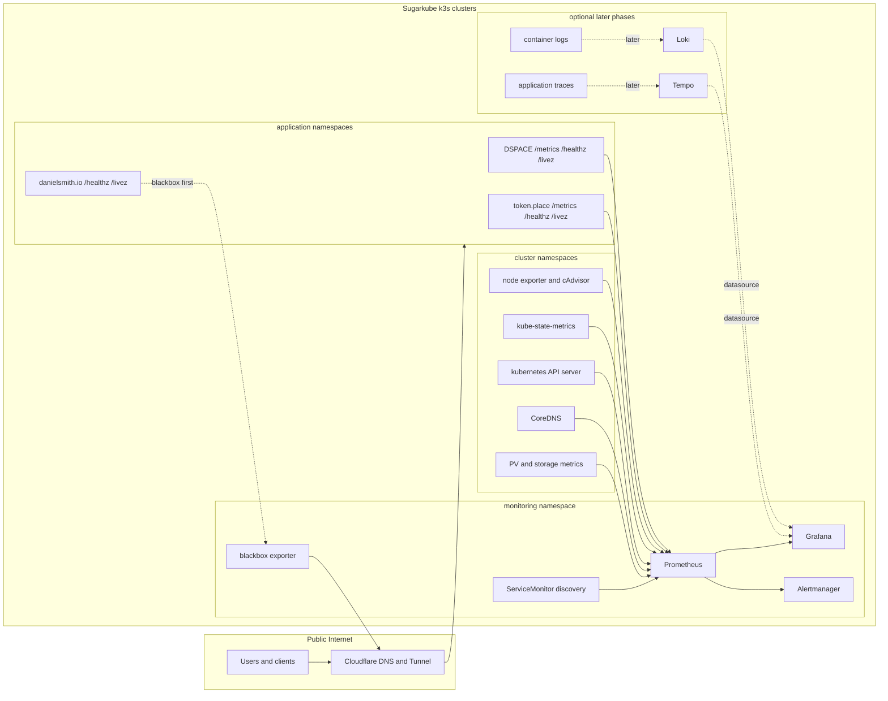

# Sugarkube observability design

Status: canonical design, implementation-ready, documentation only.

This document is the cross-application observability contract for Sugarkube,
DSPACE, token.place, and danielsmith.io. It reconciles the implementation-heavy
bootstrap prompt in [docs/prompts/codex/observability.md](prompts/codex/observability.md)
with the current requirement to design only: do not install or change Prometheus,
Grafana, Loki, exporters, dashboards, Helm values, manifests, or runtime code as
part of this document.

## Goals

- Provide a practical path for learning Prometheus and Grafana while moving
  toward production operations on a small k3s cluster.
- Cover cluster, application, dependency, and external availability signals.
- Optimize for Raspberry Pis and other SBCs: low scrape volume, bounded
  cardinality, modest retention, and explicit storage budgets.
- Reuse the existing GHCR-first app deployment contract and app runbooks rather
  than creating a parallel deployment surface.
- Define concrete requirements for DSPACE v3.1.0, token.place v0.1.2, and
  danielsmith.io v0.1.0 release gates.
- Keep privacy boundaries explicit before metrics, logs, dashboards, or alerts
  are treated as release evidence.

## Non-goals

- Installing, upgrading, or enabling runtime observability components in this
  change.
- Claiming Daniel has production Prometheus or Grafana operating experience.
  This document is a learning and productionization plan; resume claims require
  the release evidence listed below.
- Treating Loki, Tempo, long-term object storage, multi-cluster federation, or
  public Grafana access as phase-one requirements. Existing Flux scaffolding for
  Loki and promtail is inventory, not proof of a production logging requirement.
- Replacing the app deployment contract, app chart ownership, Cloudflare tunnel
  ownership, or GitHub release artifact workflow.
- Treating GitHub repository stars, issues, or workflow metadata as substitutes
  for service health, latency, error, or saturation signals.

## Audit basis

Sugarkube files inspected:

- [README.md](../README.md)
- [docs/index.md](index.md)
- [docs/app_deployment_contract.md](app_deployment_contract.md)
- [docs/pi_image_telemetry.md](pi_image_telemetry.md)
- [docs/prompts/codex/observability.md](prompts/codex/observability.md)
- [platform/](../platform/)
- [scripts/cloud-init/](../scripts/cloud-init/)
- [docs/apps/dspace.md](apps/dspace.md)
- [docs/apps/tokenplace.md](apps/tokenplace.md)
- [docs/apps/danielsmith.md](apps/danielsmith.md)

Public main branches inspected on 2026-06-19:

- `democratizedspace/dspace` at `005dbc8`
- `futuroptimist/token.place` at `4df38a6`
- `futuroptimist/danielsmith.io` at `ecac5b6`

The audit distinguishes deployed facts from source scaffolding. A file in an app
repo proves capability or intent only when a runbook or release gate verifies it
in an environment.

## Current-state inventory

| Area | Implemented and tested | Documented but not verified here | Planned | Explicitly out of scope |
| --- | --- | --- | --- | --- |
| Sugarkube cluster and Pi image | Flux manifests exist for kube-prometheus-stack, Loki, and promtail under `platform/observability/`, with Prometheus retention set to `15d`, one replica, a `cluster=sugarkube` external label, and a `50Gi` Longhorn PVC. The Pi image telemetry guide documents opt-in telemetry and built-in scraping targets for Grafana Agent, node exporter, cAdvisor, and Netdata. | The platform files are scaffolding only in this audit; no cluster was queried to prove Prometheus, Grafana, Loki, or promtail are running. README says the image ships node exporter, cAdvisor, Grafana Agent, and Netdata containers, but that is not production Prometheus/Grafana evidence. | A low-cardinality Prometheus/Grafana foundation, blackbox exporter, dashboards, and alerts. | Runtime installation in this PR; resume claims before release evidence exists. |
| DSPACE | Main branch has `/metrics` implemented with `prom-client` default metrics and optional bearer-token protection. The chart has `/livez` and `/healthz` probe paths and tests cover network policy access for metrics scraping. | Sugarkube verifies `/config.json`, `/healthz`, and `/livez`; it does not yet verify `/metrics`, dChat metrics, ServiceMonitor resources, dashboards, or alerts. | DSPACE v3.1.0 must add application metrics for public HTTP, dChat outcomes, token.place dependency health, release identity, and safe SSR/hydration signals. | Chat content, save data, inventory, user identity, prompts, responses, and raw errors in metrics or logs. |
| token.place | Main branch documents `/metrics`, `/livez`, `/healthz`, `/relay/diagnostics`, `/api/v1/meta`, and API v1 release checks. It has a Helm chart, image/chart workflows, relay-only k8s manifests, and production-promotion checks for real compute-node registration and E2EE relay success. | Sugarkube app verification checks public health paths but not Prometheus scraping, dashboards, alerts, or production metric baselines. Existing docs state in-memory relay state loss on pod restart is acceptable but must be visible operationally. | token.place v0.1.2 must expose bounded relay/API metrics, compute-node health, queue depth, lease age, cancellation/timeout/rate-limit counters, upstream inference health, and release identity. | Breaking relay-blind E2EE by putting plaintext prompts, responses, ciphertext, keys, auth headers, user identity, request IDs, or unbounded model names into metrics/logs/dashboards/alerts. |
| danielsmith.io | Main branch is a static nginx image with `/healthz` and `/livez`, a Helm chart with probes, image/chart workflows, and an optional GitHub metrics cache sidecar that writes `/runtime/github-metrics.json`. | Sugarkube verifies `/`, `/livez`, and `/healthz`; staging/prod manual checks verify the GitHub cache JSON. No app `/metrics` endpoint, ServiceMonitor, or operational dashboard was verified. | danielsmith.io v0.1.0 should be monitored first with blackbox probes, Kubernetes readiness/restart/resource metrics, TLS expiry, and release/image labels. Browser performance telemetry is a later privacy-reviewed phase. | Treating GitHub cache values as uptime or SLO evidence; adding browser telemetry before privacy review. |
| Cloudflare ingress/tunnels | `platform/cloudflared/` and `docs/cloudflare_tunnel.md` document token-based, remotely managed Cloudflare Tunnel connectors and readiness on port `2000`. App runbooks state Cloudflare DNS and tunnels are outside Helm. | This audit did not query Cloudflare, DNS, or live tunnel status. | Blackbox public probes for host availability, latency, TLS expiry, and Cloudflare-route failures. | Managing DNS/Tunnel routes from application Helm charts. |
| GitHub Actions and release artifacts | App runbooks link image workflows, chart workflows, GHCR images, chart packages, Dockerfiles, and chart sources for all flagship apps. | Successful workflow links are discovery aids; this audit did not prove the latest workflow artifacts are deployed. | Dashboards may include release identity and workflow freshness as context. | Using stars, issue counts, or workflow success as substitutes for service observability. |

## Ownership boundaries

Application repositories own:

- Application metrics and bounded label vocabularies.
- Health and liveness endpoints.
- Release metadata endpoints or labels.
- Container images and immutable tags.
- Helm chart hooks for scraping, such as ServiceMonitor templates or equivalent
  pod annotations when Sugarkube enables them.
- App-specific runbooks and release gates.

Sugarkube owns:

- Prometheus, Grafana, Alertmanager, blackbox exporter, retention, storage
  budgets, and resource requests/limits.
- Environment configuration for dev, staging, and production.
- ServiceMonitor discovery policy and namespace selection.
- Public endpoint probing, TLS expiry checks, shared dashboards, alert routing,
  and cluster runbooks.
- Baseline reviews after real staging and production data exists.

Cloudflare and DNS remain separate from Helm app deployment. Helm charts may
publish Ingress objects, but Cloudflare tunnel creation, DNS routing, WAF, and
Access policy remain operator/platform concerns.

GitHub repository statistics are product/content signals. They may enrich a
portfolio dashboard, but they are not service observability signals and cannot
prove a service is available, fast, or reliable.

## Proposed architecture

### Namespaces

- Use `monitoring` initially to match existing platform scaffolding.
- Application namespaces remain `dspace`, `tokenplace`, and `danielsmith`.
- ServiceMonitor discovery should be limited to explicitly labeled namespaces
  and services rather than all namespaces by default.
- Staging and production must use separate clusters or Prometheus external
  labels: `cluster`, `environment`, and `prometheus_replica` where applicable.

### Service discovery

- Phase one: cluster and Kubernetes metrics from kube-prometheus-stack plus
  blackbox targets for public endpoints.
- Application scrapes require app charts to opt in with ServiceMonitor resources
  or compatible annotations. Sugarkube selects which namespaces are discoverable.
- Scrape intervals start at `30s` for cluster/app health and `60s` for public
  blackbox probes unless staging data proves a need for tighter intervals.

### Retention, storage, and resource budgets

- Start with `15d` Prometheus retention and a single `50Gi` PVC only if the
  storage class is reliable for the target cluster; otherwise reduce retention
  before deployment.
- Keep high-volume histograms limited to critical request paths and bounded
  outcomes.
- For Raspberry Pi and SBC clusters, prefer fewer dashboards and lower-cardinality
  metrics over broad default exporters.
- Alert on scrape failures and disk pressure before retention exhaustion causes a
  silent observability outage.

### Persistent storage expectations

- Prometheus needs persistent storage for useful trend and incident review data.
- Grafana dashboards should be provisioned from versioned ConfigMaps or files,
  not hand-edited only in the UI.
- Loki and Tempo storage are later-phase decisions; do not require object storage
  or log retention for the first productionization gate.

### Staging versus production

- Staging must receive the observability stack first and collect at least one
  week of normal traffic or synthetic probes before production thresholds are
  finalized.
- Production alerts must start with a small actionable set and use provisional
  thresholds until staging and production baselines are reviewed.
- Dashboard JSON, alert rules, and runbooks should be promoted like app release
  artifacts.

### Failure behavior

- If Prometheus or Grafana is unavailable, applications must continue serving
  traffic.
- App `/metrics` endpoints should fail independently from `/healthz` and must not
  become a user-facing dependency.
- If the observability stack is down, operators fall back to `kubectl`, app
  runbooks, public `curl` checks, and Cloudflare dashboard evidence.
- Alertmanager delivery failure must alert locally in Grafana/Prometheus UI once
  the stack recovers and be visible in runbooks.

## Metrics and labeling contract

Metric names:

- Use Prometheus naming: lowercase snake case, application prefix, base unit
  suffix where applicable.
- Counters end in `_total`, durations use `_seconds`, byte sizes use `_bytes`,
  and gauges describe current state.
- Examples: `dspace_http_requests_total`,
  `tokenplace_relay_queue_depth`, `danielsmith_blackbox_probe_success`.

Required common labels for app metrics:

- `app`: stable app slug, one of `dspace`, `tokenplace`, `danielsmith`.
- `environment`: `dev`, `staging`, or `prod`.
- `cluster`: Sugarkube cluster identifier.
- `namespace`: Kubernetes namespace.
- `release`: immutable application release or image tag.

Bounded labels:

- `route`: route template or route class, not raw URL. Examples:
  `/api/v1/chat/completions`, `/healthz`, `static_asset`, `unknown`.
- `method`: HTTP method from a fixed set.
- `status_class`: `2xx`, `3xx`, `4xx`, `5xx`.
- `outcome`: fixed vocabulary such as `success`, `validation_error`,
  `rate_limited`, `timeout`, `dependency_failure`, `cancelled`, `server_error`.
- `dependency`: fixed dependency name such as `tokenplace`, `github`,
  `cloudflare`, `kubernetes_api`, `coredns`.

Histograms:

- Use histograms for request and dependency latency, not summaries.
- Start with conservative buckets appropriate to web/API latency, for example
  `0.05`, `0.1`, `0.25`, `0.5`, `1`, `2.5`, `5`, and `10` seconds.
- Add slower buckets only when staging shows legitimate long-running work.
- Keep route and outcome labels bounded before enabling histograms.

Cardinality limits:

- Any single application should target fewer than 100 active series per endpoint
  family at launch.
- New labels need a written vocabulary and an estimate of max values.
- Do not expose per-user, per-request, per-session, per-IP, per-save, per-model,
  or per-exception series.

Prohibited labels and payloads:

- User identifiers.
- IP addresses.
- Request IDs.
- Prompts or responses.
- Player save data or inventory.
- API keys, cryptographic keys, ciphertext, or authentication headers.
- Unbounded URLs, exception text, model names, or arbitrary error strings.

## Platform SLIs and candidate alerts

Thresholds below are provisional. Staging data must establish final alert values;
these are not SLO commitments.

| Signal | Candidate SLI | Provisional alert | Window | Notes |
| --- | --- | --- | --- | --- |
| Node readiness | Ready nodes / expected nodes | Warning when any node is NotReady; critical when quorum or all app capacity is at risk | 5m | Tune for planned maintenance. |
| Disk pressure | Nodes without disk pressure | Warning on any disk pressure | 10m | Include root disk and Prometheus PVC. |
| Memory pressure | Nodes without memory pressure | Warning on sustained memory pressure | 10m | SBC clusters may need app rescheduling or lower limits. |
| API server health | API server scrape/up and request success | Critical when API server target down | 5m | Avoid duplicate pages if cluster unreachable by design. |
| DNS health | CoreDNS pods ready and DNS probe success | Warning on CoreDNS unavailable or probe failures | 5m | DNS failures break app dependencies. |
| Pod restarts | Restart rate by namespace/deployment | Warning on >3 restarts in 15m; critical on crash loop | 15m | Suppress during intentional rollout windows. |
| Deployment readiness | Available replicas / desired replicas | Warning below desired for app deployments | 10m | Route to app runbook. |
| Persistent volumes | PVC bound and available bytes | Warning below 20%; critical below 10% or PVC not bound | 15m | Start conservative until actual growth is known. |
| Public endpoint success | blackbox `probe_success` | Warning on 2 consecutive failures; critical on 5m sustained failure | 2m/5m | Probe `/`, health endpoints, and key static assets. |
| Public latency | blackbox duration p95 or probe duration | Warning above 2s for health probes | 10m | Replace with measured baseline after staging. |
| TLS expiry | Days until certificate expiry | Warning <14d; critical <7d | 1h | Include Cloudflare/public certs. |
| Prometheus scrape health | `up` and scrape samples | Warning when critical target down | 5m | Include app and blackbox targets. |
| Alertmanager delivery | Alertmanager up and notification failures | Warning on delivery failures or Alertmanager down | 10m | Do not page on routes without a receiver. |

## DSPACE-specific story

### Verified current behavior

- DSPACE main branch has a `/metrics` endpoint backed by `prom-client` default
  metrics and optional `METRICS_TOKEN` bearer auth.
- The chart defines `/livez` and `/healthz` probe paths.
- Sugarkube runbooks verify `/config.json`, `/healthz`, and `/livez` for DSPACE
  deployments.
- Existing DSPACE design docs cover dChat behavior and token.place migration, but
  this audit did not verify deployed dChat metrics, dashboards, or alerts.

### DSPACE v3.1.0 minimum release gate

DSPACE v3.1.0 must ship or explicitly defer with release-owner approval:

- Public availability metrics:
  - `dspace_http_requests_total{route,method,status_class,outcome,...}`.
  - `dspace_http_request_duration_seconds_bucket{route,method,outcome,...}`.
  - Bounded route names for `/`, `/chat`, `/config.json`, `/healthz`, `/livez`,
    `/metrics`, and static/docs route classes.
- Process/runtime health:
  - Default process metrics from `prom-client` remain acceptable.
  - Build information gauge, for example `dspace_build_info{release,commit}` with
    value `1`.
- dChat metrics:
  - Request count and latency.
  - Outcome categories: `success`, `validation_error`, `timeout`,
    `rate_limited`, `dependency_failure`, `cancelled`, `server_error`.
  - Dependency metrics for token.place: availability, latency, timeout count,
    and last successful request age.
- SSR/hydration failures:
  - Only count safe bounded events that are already observable without storing
    user content. Do not add browser telemetry until reviewed.
- Dashboard:
  - Public availability, app process health, dChat traffic, dChat outcome mix,
    token.place dependency health, rollout identity, and pod restarts.
- Alerts:
  - Public endpoint failure.
  - Elevated 5xx or dChat dependency failure rate.
  - Sustained token.place dependency outage.
  - Crash loop or deployment not ready.
- Privacy:
  - No chat content, prompts, responses, save data, inventory, user identity,
    request IDs, IP addresses, raw exception text, or unbounded model strings in
    metrics or logs.

## token.place-specific story

### Verified current behavior

- token.place main branch documents `/metrics`, `/livez`, `/healthz`,
  `/relay/diagnostics`, `/api/v1/meta`, and release-promotion checks.
- The relay and API v1 are the active runtime target for the current release
  line; API v1 is non-streaming.
- Promotion docs require real external compute-node registration and a real E2EE
  request/response path; health checks alone are not sufficient.
- The Helm chart and CI workflows exist, but this audit did not verify live
  Prometheus scraping, dashboards, alerts, or production metric baselines.

### token.place v0.1.2 minimum release gate

The v0.1.2 release gate must preserve relay-blind E2EE and include:

- Relay and API v1 availability:
  - `tokenplace_http_requests_total{route,method,status_class,outcome,...}`.
  - `tokenplace_http_request_duration_seconds_bucket{route,method,outcome,...}`.
  - Route templates for `/api/v1/chat/completions`, `/api/v1/health`,
    `/healthz`, `/livez`, `/metrics`, `/relay/diagnostics`, and bounded relay
    control-plane routes.
- Queue and compute-node health:
  - `tokenplace_relay_queue_depth` gauge.
  - Registered compute nodes and healthy compute nodes gauges.
  - Lease age histogram or max lease age gauge.
  - Stale-node eviction counter.
- Request lifecycle:
  - In-flight requests gauge.
  - Cancellation, timeout, and rate-limit rejection counters.
  - Dependency-failure counter for unavailable compute nodes or upstream
    inference failure.
- Upstream inference:
  - Bounded latency histogram and availability gauge/counter for the upstream
    class, not raw model names or hostnames.
- Pod restart and state-loss visibility:
  - Dashboard row showing restarts and a note that relay in-memory state loss on
    restart is accepted but operationally visible.
- Release identity:
  - `tokenplace_build_info{release,commit,chart_version}` with value `1` or
    equivalent public-safe metadata.
- Dashboard:
  - API success/latency, relay queue, compute nodes, lease freshness,
    E2EE request lifecycle, rate limits, upstream health, restarts, and release
    identity.
- Alerts:
  - Public/API health failure.
  - No healthy compute nodes in staging/prod when the environment is expected to
    have at least one.
  - Queue depth sustained above baseline.
  - Lease ages exceed stale threshold.
  - Elevated timeout/rate-limit/dependency-failure outcomes.
  - Deployment not ready or crash loop.
- Relay-blind invariants:
  - Metrics, logs, dashboards, and alerts must not include plaintext prompts,
    plaintext responses, ciphertext payloads, cryptographic keys, API keys,
    authentication headers, user identity, request IDs, IP addresses, raw model
    names, or unbounded error strings.

## danielsmith.io-specific story

### Verified current behavior

- danielsmith.io main branch builds a static site into an unprivileged nginx
  image.
- nginx serves `/healthz` and `/livez` JSON endpoints.
- The Helm chart defines liveness and readiness probes for those paths and an
  optional GitHub metrics cache sidecar.
- Sugarkube runbooks verify `/`, `/livez`, and `/healthz`; staging/prod manual
  checks inspect `/runtime/github-metrics.json`.
- The GitHub metrics cache is project/content metadata, not operational service
  telemetry.

### danielsmith.io v0.1.0 minimum release gate

- Blackbox monitoring:
  - Probe `https://danielsmith.io/`, `/livez`, `/healthz`, and `/resume.pdf` in
    production.
  - Probe staging equivalents before promotion.
  - Record `probe_success`, HTTP status, probe duration, and TLS expiry.
- Kubernetes health:
  - Deployment readiness, pod restarts, nginx container CPU/memory, and OOM
    events from cluster metrics.
- Release/image identity:
  - Dashboard must show immutable image tag or digest, chart version, and
    namespace/release labels from Kubernetes metadata.
- Browser telemetry:
  - Performance, failover, and client-side error telemetry are later-phase work
    requiring privacy review, sampling limits, consent posture, and payload
    review. They are not v0.1.0 observability prerequisites.
- Dashboard:
  - Public probes, TLS, pod readiness/restarts, resource saturation, release
    identity, and GitHub cache freshness as product context only.
- Alerts:
  - Public endpoint failure for `/`, `/livez`, `/healthz`, or `/resume.pdf`.
  - TLS expiry.
  - Deployment not ready or crash loop.
  - Resource saturation if staging proves actionable thresholds.

## Dashboards

| Dashboard | Rows | Audience | Primary questions | Source metrics |
| --- | --- | --- | --- | --- |
| Sugarkube cluster overview | Nodes; API/DNS; storage; top pods; Prometheus scrape health; Alertmanager health | Platform operator | Is the cluster healthy? Is observability healthy enough to trust? | kube-state-metrics, node exporter, cAdvisor, kube-prometheus-stack self metrics |
| Application fleet overview | Deployment readiness; pod restarts; public probe success; p95 latency; 5xx/outcome mix; release identity | Platform and app maintainers | Which app or environment needs attention first? | kube-state-metrics, blackbox exporter, app metrics |
| DSPACE | Public HTTP; dChat volume/latency/outcomes; token.place dependency; process runtime; release; alerts | DSPACE maintainers | Is DSPACE available and is dChat healthy without exposing private data? | DSPACE app metrics, blackbox, Kubernetes metrics |
| token.place | API v1; relay queue; compute nodes; lease age; in-flight requests; timeouts/rate limits; upstream health; release | token.place maintainers | Can clients complete relay-blind E2EE work through healthy compute nodes? | token.place app metrics, blackbox, Kubernetes metrics |
| danielsmith.io | Public probes; TLS; nginx readiness/restarts; CPU/memory; release; GitHub cache freshness | Site maintainer | Is the portfolio reachable and serving key assets? | blackbox, Kubernetes metrics, GitHub cache freshness as context |
| External availability and TLS | Endpoint matrix; Cloudflare route status by hostname; TLS expiry; latency trend | Platform operator | Are public routes and certificates healthy across apps? | blackbox exporter |

## First alert set and runbooks

| Alert | Severity | Signal | Provisional threshold | Window | Likely causes | Runbook | Mitigation |
| --- | --- | --- | --- | --- | --- | --- | --- |
| PublicEndpointDown | critical | `probe_success == 0` | 5m sustained failure for production endpoint | 5m | App down, Cloudflare tunnel issue, DNS/TLS failure | `docs/apps/<app>.md`, `docs/cloudflare_tunnel.md` | Check app rollout, tunnel readiness, rollback app tag if deploy-related |
| PublicEndpointFlaky | warning | blackbox failures | 2 failures in 10m | 10m | Network instability, Cloudflare issue, overloaded pod | app runbook | Inspect logs/status; avoid paging unless sustained |
| TLSExpiringSoon | warning/critical | TLS expiry | warning <14d, critical <7d | 1h | cert-manager/DNS/Cloudflare renewal issue | `docs/cloudflare_tunnel.md`, cert-manager docs | Renew/fix DNS challenge or Cloudflare route |
| DeploymentNotReady | warning | available replicas below desired | 10m | 10m | bad image, failed rollout, scheduling/storage issue | app runbook | `just app-status`; rollback to previous immutable tag |
| PodCrashLooping | warning | restart rate | >3 restarts in 15m | 15m | app bug, bad config, resource limit | app runbook | inspect logs; rollback or adjust config |
| NodeNotReady | critical when capacity at risk | node ready state | any production node NotReady; critical if quorum/capacity at risk | 5m | power, SD/SSD, network, k3s issue | `docs/raspi_cluster_troubleshooting.md` | repair node, drain if possible, reduce workload |
| StorageFilling | warning/critical | PVC free bytes | warning <20%, critical <10% | 15m | Prometheus retention, logs, app data growth | `docs/raspi_cluster_operations.md` | reduce retention, expand PVC, clean safe data |
| PrometheusScrapeDown | warning | `up == 0` for critical target | 5m | 5m | ServiceMonitor mismatch, network policy, endpoint down | this design + app runbook | fix scrape config or endpoint |
| AlertmanagerDeliveryFailing | warning | notification failures | any sustained delivery failure | 10m | receiver config, network, credentials | future `docs/observability-runbook.md` | fix receiver; avoid paging through broken channel |
| DspaceDchatDependencyFailing | warning | dChat dependency outcome | >5% dependency failures after baseline review | 15m | token.place outage, config, rate limit | `docs/apps/dspace.md`, `docs/apps/tokenplace.md` | switch provider if supported, rollback, or degrade UI |
| TokenplaceNoHealthyComputeNodes | critical in prod if expected nodes >0 | healthy compute-node gauge | zero healthy nodes | 5m | compute node offline, Cloudflare/WAF, lease expiry | `docs/apps/tokenplace.md` | restart/re-register compute node; verify E2EE path |
| DanielsmithKeyAssetDown | warning | blackbox `/resume.pdf` | failed for 10m | 10m | static asset missing, bad image, route issue | `docs/apps/danielsmith.md` | rollback image or restore asset |

Do not page on a symptom unless the runbook has an operator action. For example,
GitHub star-cache staleness should be dashboard context or a ticket, not a page.

## Phased rollout

1. Inventory and naming contract.
   - Finalize metric names, labels, prohibited payloads, and release identity.
   - Can proceed in parallel with app implementation planning.
2. Cluster monitoring foundation.
   - Deploy or verify kube-prometheus-stack in staging only.
   - Confirm retention, PVC, resource limits, and self-scrape health.
3. Blackbox monitoring.
   - Add staging public probes for all app health paths and key assets.
   - Production probes wait until staging dashboards are reviewed.
4. Application scrape integration.
   - Apps add metrics and ServiceMonitor hooks in their repos.
   - Sugarkube enables discovery by namespace/app label.
5. Dashboards.
   - Start with cluster, app fleet, and external availability.
   - Add app-specific dashboards after app metrics exist.
6. Alerts.
   - Add only the first actionable alert set.
   - Route warnings to low-noise channels until failure drills validate response.
7. Staging failure drills.
   - Break one public probe, one app rollout, one scrape target, and one alert
     receiver in staging; document evidence.
8. Production rollout.
   - Promote stack and dashboards with known resource budgets.
   - Enable critical alerts only after receiver delivery is tested.
9. Post-release baseline review.
   - Review one to two weeks of data.
   - Replace provisional thresholds with measured thresholds or document why no
     alert is actionable.

Parallel work:

- DSPACE, token.place, and danielsmith.io can implement app-owned metrics and
  chart hooks while Sugarkube prepares blackbox and cluster dashboards.
- Runbook drafting can proceed before runtime deployment, but alert rules should
  wait for staging data.

Dependencies:

- App dashboards depend on app metrics and release identity.
- Production alerts depend on staging deployment, real metrics, and receiver
  delivery tests.
- Resume skill evidence depends on staging and production proof, not on source
  files alone.

## Release evidence before resume skill claims

Prometheus or Grafana may be listed as resume skills only after all of the
following evidence exists:

- Successful staging deployment of the observability stack.
- Successful production deployment of the observability stack.
- Dashboards backed by real cluster, app, and blackbox metrics.
- At least one tested alert with delivery evidence.
- At least one documented failure drill or incident.
- Operator runbooks for deployment, troubleshooting, rollback, and alert
  response.
- Release notes or QA evidence from DSPACE, token.place, and danielsmith.io
  showing their minimum gates were met.

## Open questions

- Should `monitoring` remain the namespace or should a future migration use
  `observability` for readability? Existing platform files use `monitoring`, so
  this design keeps it for phase one.
- Should app charts expose ServiceMonitor templates directly, or should
  Sugarkube own separate ServiceMonitor manifests? The preferred contract is app
  chart support with Sugarkube deciding whether discovery is enabled.
- What is the smallest useful Prometheus retention for a Pi cluster with limited
  SSD endurance once real sample volume is measured?
- Which alert receiver is appropriate for staging warnings before production
  paging is introduced?
