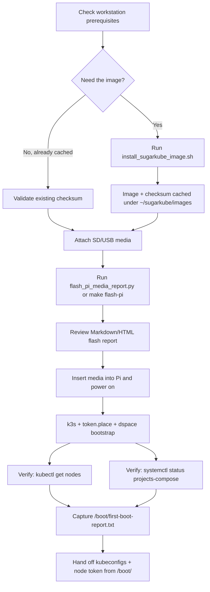

# Pi Image Flowcharts

These flowcharts map the sugarkube Pi journey from download to a healthy k3s cluster.
Use them alongside the [Pi Image Quickstart](./pi_image_quickstart.md) when planning
workshops or handoffs.

## 10-minute fast path



## Detailed provisioning path

```mermaid
flowchart TD
    subgraph Prep
        P1[Clone repository or download release] --> P2[Create ~/sugarkube/images cache]
        P2 --> P3[Render Raspberry Pi Imager presets]
        P3 --> P4[Record secrets in secrets.env]
    end

    subgraph Flashing
        F1[Select media device via flash_pi_media.py] --> F2[Stream .img.xz with verification]
        F2 --> F3[Generate Markdown/HTML/JSON flash reports]
        F3 --> F4[Archive reports under ~/sugarkube/reports]
    end

    subgraph FirstBoot
        B1[Boot Pi with flashed media] --> B2[cloud-init config applies]
        B2 --> B3[k3s + projects-compose install]
        B3 --> B4[pi_node_verifier.sh runs]
        B4 --> B5[/boot/first-boot-report.txt updated]
        B5 --> B6[/boot kubeconfigs + node token exported]
    end

    subgraph PostBoot
        PB1[Optional: run SSD clone workflow] --> PB2[Monitor /var/log/sugarkube/]
        PB2 --> PB3[Run rollback_to_sd.sh if needed]
        PB3 --> PB4[Collect verifier + flash reports for audit]
        PB4 --> PB5[Optional: enable sugarkube-telemetry timer]
    end

    Prep --> Flashing --> FirstBoot --> PostBoot
```

## Flowchart usage tips

- Print the fast path when onboarding new operators so they can track progress at a glance.
- Embed the detailed provisioning path in runbooks alongside troubleshooting tables.
- Update the diagrams as new automation (e.g., SSD clone services or telemetry hooks) lands.
